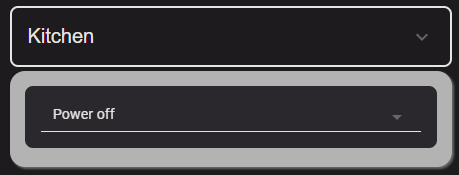
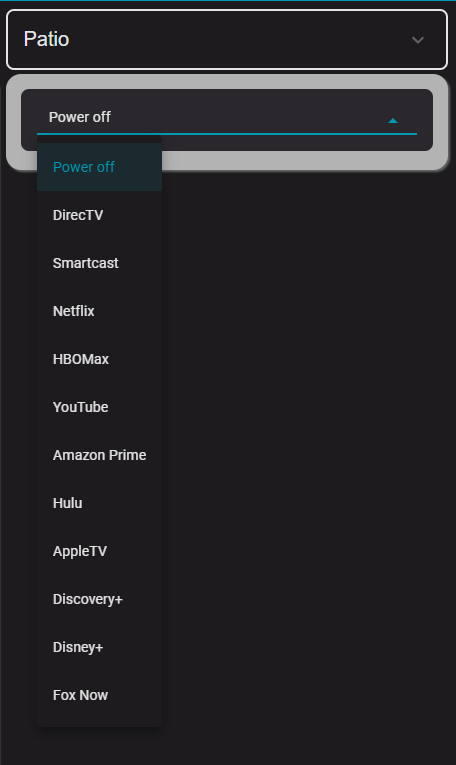
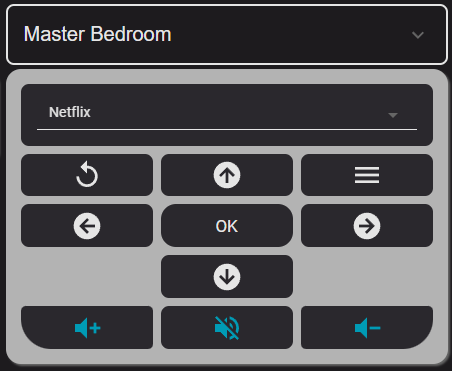
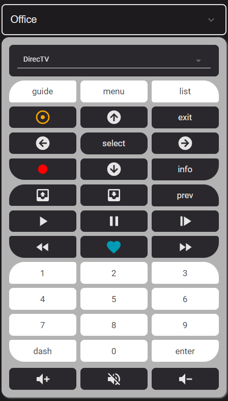
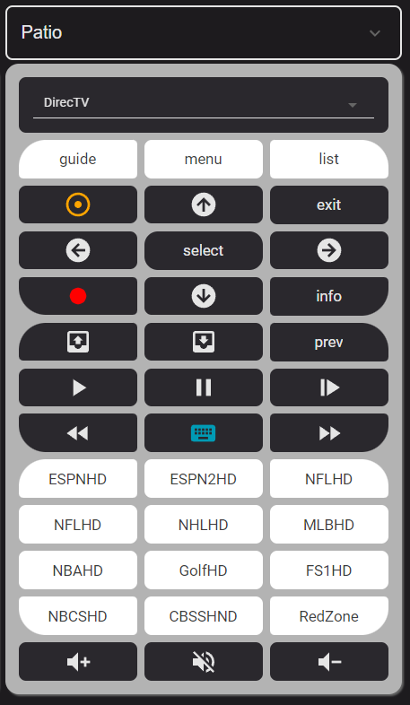
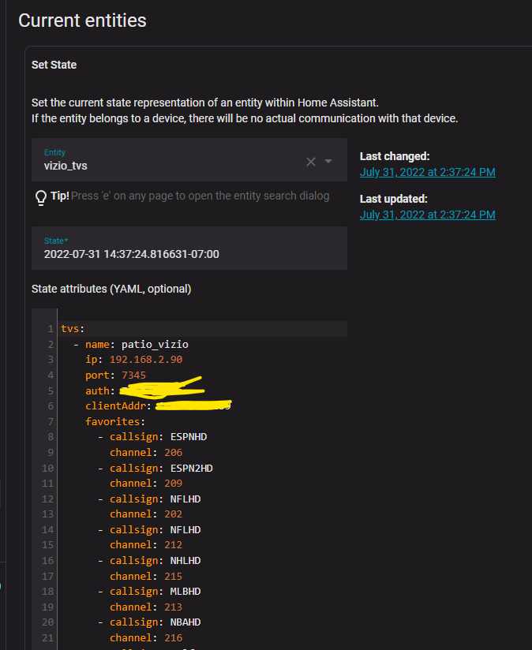

# Vizio + DirecTV  Home Assistant Remote 

**NOTE: I have posted an issue as the Vizio TV integration seems broken for new Vizio TVs from an update that just happened. I will do any modifications needed after this gets resolved.**

**See https://github.com/home-assistant/core/issues/83689#issuecomment-1349992397 for more information. Selecting "inputs" (HDMI-1, HDMI-2, CAST) no longer works on modern Vizio TVs that got a new firmware update. Selecting "apps" (Netflix, YouTube, HBOMax) does still work.**

I hate remotes. Period. So I wanted to eliminate all them for phone/PAD/computer Home Assistant interfaces. This is a collection of YAML, sensors and automations that I used to do that.

First off, I have four Vizio TVs all with DirecTV boxes. The DirectTV system we use is the Genie with one main box wired and a video bridge that has three wireless Genie Mini's. I should also note that we have a few  Broadlink devices to support two of the four TVs . One is used for an old Denon reveiver in the Bedroom that only have IR input. The other is used for an older Vizio soundbar in the kitchen that also has IR  input.

Requirements were that it must be easy to operate for the wife and look somewhat if not totally similar to the existing remotes she is used to.  She also wanted to have quick access to things she frequently does, like starting up Netflix or watch DirecTV Food Network.


## The Results

Below are some screen and descriptions of the result. This repository includes all of the YAML to build it out with a discussion of what was done. There is definately room for improvement to make things even more standardized.

I liked the look of the collapsable card for such things, especially on a phone. I did try a swiper card but the results were not good so I abandonded that for now. The default view is "Power off" and it is a simple display.



The input_select used in this mode is actually driven by a custom JSON file I created. More on this later and what it is used for.

For a quick select of an action, one can drop down the input_select and pick something to do:



For instance, I could select "Netflix" which will turn on the Vizio if it is not already on and go to casting Netflix directly:



Or I can select DirecTV which will set the TV to HDMI-1 (which is DirecTV in my setup). The last channel tuned  would be on. There are two modes to the DirecTV remote, either keypad:



Or favorites:



The setup for favorites is controlled by the custom JSON file I use and you can setup different favorites by DirecTV box. The code assumed you have as many favorites as keypad buttons, I could allow for less if I wanted to program that. Toggling between keypad and favorites is in the GUI of the remote control with an input_boolean so that the previous mode is always remembered.

The GUI makes extensive use of custom:button-card because of the abilty to create templates that can be reused when behavior only changes based on some variables. This is so important to making a nice, repeatable and easy to create remote. There is in fact a few more areas where I know I can reduce complexity, I just have not gotten to them yet but will do so in the future.


## Setting Up the Integrations

Since this is a fairly complex system built specifically for Vizio and DirecTV, I will cover some of the details here I used to integrate these. 


### DirecTV

The standard, Home Assistant DirecTV integration is fine, I used that out of the box to gain access to all the DirecTV boxes which were recognized by the application. The DirecTV Genie operates by a standard main box which has an IP address. Wireless remote Genies are all accessed by knowing the main box's IP address and the wireless remote Genie's Cient Address (clientAddr). The you can find the client address in many ways, either through the created sensors or through the DirecTV GUI for the television or by knowing the secret that it is merely the MacID of the box without the "." separators.
### Vizio

While the standard Vizio integration is also likely pretty good, the issue is that you need an AUTH code for the television to be able to send commands to it. If you setup the Vizio through the Home Assistant Vizio integration, I could not find any way of getting the AUTH code. Therefore I created a new one using some simple commands. I would highly suggest reading through this thread which desribes using the REST API for a Vizio TV to get eventually the AUTH code that you need. [Vizio TV Integration](https://community.home-assistant.io/t/vizio-tv-integration/372376/14)

I also highly recommend reserving IP addresses or manually setting up your Vizio TV not to use DHCP, but instead use a fixed (or reserved) IP address. Let's say I set up my TV as 192.168.2.90, I could open a web browser and do this (note this is curl used from Windows, hence you need to escape the quote character with the backslash):

```
curl -k -H "Content-Type: application/json" -X PUT -d "{\"DEVICE_ID\":\"12345\",\"DEVICE_NAME\":\"Patio_Vizio\"}" https://192.168.2.90:7345/pairing/start
```
You need at least your IP and your port (which should be 7345 for a modern Vizio TV). When you are successful, a pin code will display on the TV and you would get something like this back:

```
{"STATUS": {"RESULT": "SUCCESS", "DETAIL": "Success"}, "ITEM": {"CHALLENGE_TYPE": 1, "PAIRING_REQ_TOKEN": #######}}
```
Of course, the Token would be your token. Then you execute another command to get the AUTH code using your token and ID:

```
curl -k -H "Content-Type: application/json" -X PUT -d "{\"DEVICE_ID\": \"12345\",\"CHALLENGE_TYPE\": 1,\"RESPONSE_VALUE\": \"####\",\"PAIRING_REQ_TOKEN\": ######}" https://192.168.2.90:7345/pairing/pair
```
You might not be in Windows. I am, hence the extra escape /'s.
I put those commands in a text editor so I can easily copy/paste.

Once you do this you will never need to do it again. You can actually go into settings on the TV and see the pairing. Unless the TV loses this pairing, you need not ever do it again.

When you succeed at both steps, the second response would be like this:

```
{"STATUS": {"RESULT": "SUCCESS", "DETAIL": "Success"}, "ITEM": {"AUTH_TOKEN": "***********"}}
```
That AUTH_TOKEN is what you want to record/write down … that is the secret that allows you to speak to your TV via the REST commands. This is what I put into my vizio_tv.json file among other things.

Again, I would note that the Vizio Home Assistant Integration does all this for you **except** I see no way of knowing the actual AUTH code. And without that code, you cannot call the REST service. So I just do it myself.

Once you have the AUTH code, you are ready to go forward. 

## TV Sensor

I chose to create a JSON file and sensor that contains all the information I wanted for the televisions. This includes both DirecTV information as well as favorites and inputs. While I could have used some other techniques (like reading the allowable Cast names directly from the existing Vizio sensor), I chose not to because some of the names are not what my wife preferred and she would have no idea that HDMI-1 is "DirecTV". 

So I have a JSON file that looks like this (I have blocked out my Vizio AUTH code and my DirecTV clientAddr for my remote genies):

```
{
    "tvs": [
        {
            "name": "patio_vizio",
            "ip": "192.168.2.90",
            "port": 7345,
            "auth": "************",
            "clientAddr": "************",
            "favorites": [
                 {
                    "callsign": "ESPNHD",
                    "channel": 206
                },
                 {
                    "callsign": "ESPN2HD",
                    "channel": 209
                },
                {
                    "callsign": "NFLHD",
                    "channel": 202
                },
                 {
                    "callsign": "NFLHD",
                    "channel": 212
                },
                {
                    "callsign": "NHLHD",
                    "channel": 215
                },
                 {
                    "callsign": "MLBHD",
                    "channel": 213
                },
                {
                    "callsign": "NBAHD",
                    "channel": 216
                },
                 {
                    "callsign": "GolfHD",
                    "channel": 218
                },
                {
                    "callsign": "FS1HD",
                    "channel": 219
                },
                 {
                    "callsign": "NBCSHD",
                    "channel": 220
                },
                {
                    "callsign": "CBSSHND",
                    "channel": 221
                },
                 {
                    "callsign": "RedZone",
                    "channel": 702
                },
                {
                    "callsign": "BTNHD",
                    "channel": 610
                }
            ],
            "inputs": [
                {
                    "fname": "Power off",
                    "input": "Power off" 
                },
                 {
                    "fname": "DirecTV",
                    "input": "HDMI-1"
                },
                 {
                    "fname": "Smartcast",
                    "input": "CAST"
                },
                {
                    "fname": "Netflix",
                    "input": "Netflix"
                },
                 {
                    "fname": "HBOMax",
                    "input": "HBO Max"
                },
                {
                    "fname": "YouTube",
                    "input": "YouTube"
                },
                {
                    "fname": "Amazon Prime",
                    "input": "Prime"
                },
                {
                    "fname": "Hulu",
                    "input": "Hulu"
                },
                {
                    "fname": "AppleTV",
                    "input": "Apple TV"
                },
                {
                    "fname": "Discovery+",
                    "input": "discovery+"
                },
                {
                    "fname": "Disney+",
                    "input": "Disney+"
                },
                {
                    "fname": "Fox Now",
                    "input": "FOX NOW"
                }
            ]
        },
        {
            "name": "office_vizio",
            "ip": "192.168.2.20",
            "port": 7345,
            "auth": "************",
            "clientAddr": "***********",
            "favorites": [
                 {
                    "callsign": "ESPNHD",
                    "channel": 206
                },
                 {
                    "callsign": "ESPN2HD",
                    "channel": 209
                },
                {
                    "callsign": "NFLHD",
                    "channel": 202
                },
                 {
                    "callsign": "NFLHD",
                    "channel": 212
                },
                {
                    "callsign": "NHLHD",
                    "channel": 215
                },
                 {
                    "callsign": "MLBHD",
                    "channel": 213
                },
                {
                    "callsign": "NBAHD",
                    "channel": 216
                },
                 {
                    "callsign": "GolfHD",
                    "channel": 218
                },
                {
                    "callsign": "FS1HD",
                    "channel": 219
                },
                 {
                    "callsign": "FOXNHD",
                    "channel": 360
                },
                {
                    "callsign": "CBSSHND",
                    "channel": 221
                },
                 {
                    "callsign": "RedZone",
                    "channel": 702
                },
                {
                    "callsign": "BTNHD",
                    "channel": 610
                }
            ],
            "inputs": [
                {
                    "fname": "Power off",
                    "input": "Power off" 
                },
                 {
                    "fname": "DirecTV",
                    "input": "HDMI-1"
                },
                 {
                    "fname": "Smartcast",
                    "input": "CAST"
                },
                {
                    "fname": "Netflix",
                    "input": "Netflix"
                },
                 {
                    "fname": "HBOMax",
                    "input": "HBO Max"
                },
                {
                    "fname": "YouTube",
                    "input": "YouTube"
                },
                {
                    "fname": "Amazon Prime",
                    "input": "Prime"
                },
                {
                    "fname": "Hulu",
                    "input": "Hulu"
                },
                {
                    "fname": "AppleTV",
                    "input": "Apple TV"
                },
                {
                    "fname": "Discovery+",
                    "input": "discovery+"
                },
                {
                    "fname": "Disney+",
                    "input": "Disney+"
                },
                {
                    "fname": "Fox Now",
                    "input": "FOX NOW"
                }
            ]
        },
        {
            "name": "bedroom_vizio",
            "ip": "192.168.2.5",
            "port": 7345,
            "auth": "************",
            "clientAddr": "0",
            "favorites": [
                {
                    "callsign": "HGTVHD",
                    "channel": 229
                },
                {
                    "callsign": "MAGNHD",
                    "channel": 230
                },
                {
                    "callsign": "FOXNHD",
                    "channel": 360
                },
                {
                    "callsign": "FOODHD",
                    "channel": 231
                },
                {
                    "callsign": "HISTHD",
                    "channel": 269
                },
                {
                    "callsign": "NGCHD",
                    "channel": 276
                },
                {
                    "callsign": "DSCHD",
                    "channel": 278
                },
                {
                    "callsign": "TLCHD",
                    "channel": 280
                },
                {
                    "callsign": "HBOWHD",
                    "channel": 504
                },
                {
                    "callsign": "MAXWHD",
                    "channel": 516
                },
                {
                    "callsign": "STZWHD",
                    "channel": 526
                },
                {
                    "callsign": "SHOWHD",
                    "channel": 546
                }
            ],
            "inputs": [
                {
                    "fname": "Power off",
                    "input": "Power off" 
                },
                 {
                    "fname": "DirecTV",
                    "input": "HDMI-1"
                },
                 {
                    "fname": "Smartcast",
                    "input": "CAST"
                },
                {
                    "fname": "Netflix",
                    "input": "Netflix"
                },
                 {
                    "fname": "HBOMax",
                    "input": "HBO Max"
                }
            ]
        },
        {
            "name": "kitchen_vizio",
            "ip": "192.168.2.22",
            "port": 7345,
            "auth": "************",
            "clientAddr": "************",
            "favorites": [
                {
                    "callsign": "HGTVHD",
                    "channel": 229
                },
                {
                    "callsign": "MAGNHD",
                    "channel": 230
                },
                {
                    "callsign": "FOXNHD",
                    "channel": 360
                },
                {
                    "callsign": "FOODHD",
                    "channel": 231
                },
                {
                    "callsign": "HISTHD",
                    "channel": 269
                },
                {
                    "callsign": "NGCHD",
                    "channel": 276
                },
                {
                    "callsign": "DSCHD",
                    "channel": 278
                },
                {
                    "callsign": "TLCHD",
                    "channel": 280
                },
                {
                    "callsign": "HBOWHD",
                    "channel": 504
                },
                {
                    "callsign": "MAXWHD",
                    "channel": 516
                },
                {
                    "callsign": "STZWHD",
                    "channel": 526
                },
                {
                    "callsign": "SHOWHD",
                    "channel": 546
                }
            ],
            "inputs": [
                {
                    "fname": "Power off",
                    "input": "Power off" 
                },
                 {
                    "fname": "DirecTV",
                    "input": "HDMI-1"
                },
                 {
                    "fname": "Smartcast",
                    "input": "CAST"
                },
                {
                    "fname": "Netflix",
                    "input": "Netflix"
                },
                 {
                    "fname": "HBOMax",
                    "input": "HBO Max"
                }
            ]
        }
    ]
}
```

Now, I store this file in my Home Assistant installation and I have a sensor that reads this information. In my included "sensor.yaml" file I have this:

```
- platform: rest
  name: vizio_tvs
  resource: http://192.168.2.245:8123/local/Vizio/vizio_tvs.json
  value_template: "{{ now() }}"
  json_attributes:
    - tvs
```

Essentially, this creates a sensor (sensor.vizio_tvs) whose state is just a timestamp and has an attribute that contains all the information about the TVs that is in that JSON file. You can put that JSON where you like but I keep mine by in a directory knowing what they do. I have many such things for iBBQ thermometers and other devices. This allows me to simply edit the JSON to add/change information and reload it. If I looked in developer tools I would see this:



# Input Selects for the Modes

The GUI I designed has an input_select that has a combination of inputs as well as quick actions for going directly to a Cast channel like Netflix. The GUI information is stored in the vizio_tv.json file and needs to loaded into the options for an input_select. I could have chosen to have one, but we treat our TVs differently in the house, some we want to only have Netflix and HBO Max for example, others have more allowed inputs (for quick action). I would note that this is not limting anything because one of the inputs should always be Smartcast, which allows you to then use the navigation and select buttons to play anything like Hulu or FoxNow or anything else in your apps for the Vizio TV. The input select is created in an included input_select.yaml and as I said, I have four different ones ... one for each TV:

```
patio_vizio_input:
    options:
        - Power off
office_vizio_input:
    options:
        - Power off
kitchen_vizio_input:
    options:
        - Power off
bedroom_vizio_input:
    options:
        - Power off
```

I only create the one option here .. "Power off" just to have some option. The real list is populated with an automation which is triggered is the vizio_tv.json changes. It loads all the input_selects for all TVs reading the information from the vizio_tv.json file and creating an input_select wth nice names:

```
- id: '1659026711599'
  alias: Build Vizio Inputs
  description: ''
  trigger:
  - platform: state
    entity_id:
    - sensor.vizio_tvs
  condition: []
  action:
  - service: input_select.set_options
    data_template:
      entity_id: input_select.office_vizio_input
      options: ' 
         {{tvs.inputs | map(attribute=''fname'') | list }}
         '
  - service: input_select.set_options
    data_template:
      entity_id: input_select.patio_vizio_input
      options: ' 
         {{tvs.inputs | map(attribute=''fname'') | list }}
         '
  - service: input_select.set_options
    data_template:
      entity_id: input_select.kitchen_vizio_input
      options: ' 
         {{tvs.inputs | map(attribute=''fname'') | list }}
         '
  - service: input_select.set_options
    data_template:
      entity_id: input_select.bedroom_vizio_input
      options: ' 
         {{tvs.inputs | map(attribute=''fname'') | list }}
         '
  mode: single
```
Oh, what about changing the input_select source? Like I change from "power off" to "Netflix" for from Netflix" to DirecTV. There is an  automations for all four of my TVs to handle that:

```
- id: '1658870166462'
  alias: Change Patio Vizio Source
  description: ''
  trigger:
  - platform: state
    entity_id:
    - input_select.patio_vizio_input
  condition: []
  action:
  - choose:
    - conditions:
      - condition: state
        entity_id: input_select.patio_vizio_input
        state: Power off
      sequence:
      - service: media_player.turn_off
        data: {}
        target:
          entity_id: media_player.patio_vizio
    - conditions:
      - condition: template
        value_template: '{{is_state(''media_player.patio_vizio'',''off'')}}'
      sequence:
      - service: media_player.turn_on
        data_template:
          entity_id: media_player.patio_vizio
      - delay:
          hours: 0
          minutes: 0
          seconds: 3
          milliseconds: 0
      - service: media_player.select_source
        data_template:
          source: '  {{ tv[0].inputs[choice].input }}

            '
          entity_id: media_player.patio_vizio
    - conditions:
      - condition: template
        value_template: '{{is_state(''media_player.patio_vizio'',''on'')}}'
      sequence:
      - service: media_player.select_source
        data_template:
          source: '  {{ tv[0].inputs[choice].input }}

            '
          entity_id: media_player.patio_vizio
    default: []
  mode: single
- id: '1658870166663'
  alias: Change Office Vizio Source
  description: ''
  trigger:
  - platform: state
    entity_id:
    - input_select.office_vizio_input
  condition: []
  action:
  - choose:
    - conditions:
      - condition: state
        entity_id: input_select.office_vizio_input
        state: Power off
      sequence:
      - service: media_player.turn_off
        data: {}
        target:
          entity_id: media_player.office_vizio
    - conditions:
      - condition: template
        value_template: '{{is_state(''media_player.office_vizio'',''off'')}}'
      sequence:
      - service: media_player.turn_on
        data_template:
          entity_id: media_player.office_vizio
      - delay:
          hours: 0
          minutes: 0
          seconds: 3
          milliseconds: 0
      - service: media_player.select_source
        data_template:
          source: '  {{ tv[0].inputs[choice].input }}

            '
          entity_id: media_player.office_vizio
    - conditions:
      - condition: template
        value_template: '{{is_state(''media_player.office_vizio'',''on'')}}'
      sequence:
      - service: media_player.select_source
        data_template:
          source: '  {{ tv[0].inputs[choice].input }}

            '
          entity_id: media_player.office_vizio
    default: []
  mode: single
- id: '1658870177773'
  alias: Change Kitchen Vizio Source
  description: ''
  trigger:
  - platform: state
    entity_id:
    - input_select.kitchen_vizio_input
  condition: []
  action:
  - choose:
    - conditions:
      - condition: state
        entity_id: input_select.kitchen_vizio_input
        state: Power off
      sequence:
      - service: media_player.turn_off
        data: {}
        target:
          entity_id: media_player.kitchen_vizio
    - conditions:
      - condition: template
        value_template: '{{is_state(''media_player.kitchen_vizio'',''off'')}}'
      sequence:
      - service: media_player.turn_on
        data_template:
          entity_id: media_player.kitchen_vizio
      - delay:
          hours: 0
          minutes: 0
          seconds: 3
          milliseconds: 0
      - service: media_player.select_source
        data_template:
          source: '  {{ tv[0].inputs[choice].input }}

            '
          entity_id: media_player.kitchen_vizio
    - conditions:
      - condition: template
        value_template: '{{is_state(''media_player.kitchen_vizio'',''on'')}}'
      sequence:
      - service: media_player.select_source
        data_template:
          source: '  {{ tv[0].inputs[choice].input }}

            '
          entity_id: media_player.kitchen_vizio
    default: []
  mode: single
- id: '1658870199993'
  alias: Change Bedroom Vizio Source
  description: ''
  trigger:
  - platform: state
    entity_id:
    - input_select.bedroom_vizio_input
  condition: []
  action:
  - choose:
    - conditions:
      - condition: state
        entity_id: input_select.bedroom_vizio_input
        state: Power off
      sequence:
      - service: media_player.turn_off
        data: {}
        target:
          entity_id: media_player.bedroom_vizio
    - conditions:
      - condition: template
        value_template: '{{is_state(''media_player.bedroom_vizio'',''off'')}}'
      sequence:
      - service: media_player.turn_on
        data_template:
          entity_id: media_player.bedroom_vizio
      - delay:
          hours: 0
          minutes: 0
          seconds: 3
          milliseconds: 0
      - service: media_player.select_source
        data_template:
          source: '  {{ tv[0].inputs[choice].input }}

            '
          entity_id: media_player.bedroom_vizio
    - conditions:
      - condition: template
        value_template: '{{is_state(''media_player.bedroom_vizio'',''on'')}}'
      sequence:
      - service: media_player.select_source
        data_template:
          source: '  {{ tv[0].inputs[choice].input }}

            '
          entity_id: media_player.bedroom_vizio
    default: []
  mode: single- id: '1658870166462'
  alias: Change Patio Vizio Source
  description: ''
  trigger:
  - platform: state
    entity_id:
    - input_select.patio_vizio_input
  condition: []
  action:
  - choose:
    - conditions:
      - condition: state
        entity_id: input_select.patio_vizio_input
        state: Power off
      sequence:
      - service: media_player.turn_off
        data: {}
        target:
          entity_id: media_player.patio_vizio
    - conditions:
      - condition: template
        value_template: '{{is_state(''media_player.patio_vizio'',''off'')}}'
      sequence:
      - service: media_player.turn_on
        data_template:
          entity_id: media_player.patio_vizio
      - delay:
          hours: 0
          minutes: 0
          seconds: 3
          milliseconds: 0
      - service: media_player.select_source
        data_template:
          source: '  {{ tv[0].inputs[choice].input }}

            '
          entity_id: media_player.patio_vizio
    - conditions:
      - condition: template
        value_template: '{{is_state(''media_player.patio_vizio'',''on'')}}'
      sequence:
      - service: media_player.select_source
        data_template:
          source: '  {{ tv[0].inputs[choice].input }}

            '
          entity_id: media_player.patio_vizio
    default: []
  mode: single
- id: '1658870166663'
  alias: Change Office Vizio Source
  description: ''
  trigger:
  - platform: state
    entity_id:
    - input_select.office_vizio_input
  condition: []
  action:
  - choose:
    - conditions:
      - condition: state
        entity_id: input_select.office_vizio_input
        state: Power off
      sequence:
      - service: media_player.turn_off
        data: {}
        target:
          entity_id: media_player.office_vizio
    - conditions:
      - condition: template
        value_template: '{{is_state(''media_player.office_vizio'',''off'')}}'
      sequence:
      - service: media_player.turn_on
        data_template:
          entity_id: media_player.office_vizio
      - delay:
          hours: 0
          minutes: 0
          seconds: 3
          milliseconds: 0
      - service: media_player.select_source
        data_template:
          source: '  {{ tv[0].inputs[choice].input }}

            '
          entity_id: media_player.office_vizio
    - conditions:
      - condition: template
        value_template: '{{is_state(''media_player.office_vizio'',''on'')}}'
      sequence:
      - service: media_player.select_source
        data_template:
          source: '  {{ tv[0].inputs[choice].input }}

            '
          entity_id: media_player.office_vizio
    default: []
  mode: single
- id: '1658870177773'
  alias: Change Kitchen Vizio Source
  description: ''
  trigger:
  - platform: state
    entity_id:
    - input_select.kitchen_vizio_input
  condition: []
  action:
  - choose:
    - conditions:
      - condition: state
        entity_id: input_select.kitchen_vizio_input
        state: Power off
      sequence:
      - service: media_player.turn_off
        data: {}
        target:
          entity_id: media_player.kitchen_vizio
    - conditions:
      - condition: template
        value_template: '{{is_state(''media_player.kitchen_vizio'',''off'')}}'
      sequence:
      - service: media_player.turn_on
        data_template:
          entity_id: media_player.kitchen_vizio
      - delay:
          hours: 0
          minutes: 0
          seconds: 3
          milliseconds: 0
      - service: media_player.select_source
        data_template:
          source: '  {{ tv[0].inputs[choice].input }}

            '
          entity_id: media_player.kitchen_vizio
    - conditions:
      - condition: template
        value_template: '{{is_state(''media_player.kitchen_vizio'',''on'')}}'
      sequence:
      - service: media_player.select_source
        data_template:
          source: '  {{ tv[0].inputs[choice].input }}

            '
          entity_id: media_player.kitchen_vizio
    default: []
  mode: single
- id: '1658870199993'
  alias: Change Bedroom Vizio Source
  description: ''
  trigger:
  - platform: state
    entity_id:
    - input_select.bedroom_vizio_input
  condition: []
  action:
  - choose:
    - conditions:
      - condition: state
        entity_id: input_select.bedroom_vizio_input
        state: Power off
      sequence:
      - service: media_player.turn_off
        data: {}
        target:
          entity_id: media_player.bedroom_vizio
    - conditions:
      - condition: template
        value_template: '{{is_state(''media_player.bedroom_vizio'',''off'')}}'
      sequence:
      - service: media_player.turn_on
        data_template:
          entity_id: media_player.bedroom_vizio
      - delay:
          hours: 0
          minutes: 0
          seconds: 3
          milliseconds: 0
      - service: media_player.select_source
        data_template:
          source: '  {{ tv[0].inputs[choice].input }}

            '
          entity_id: media_player.bedroom_vizio
    - conditions:
      - condition: template
        value_template: '{{is_state(''media_player.bedroom_vizio'',''on'')}}'
      sequence:
      - service: media_player.select_source
        data_template:
          source: '  {{ tv[0].inputs[choice].input }}

            '
          entity_id: media_player.bedroom_vizio
    default: []
  mode: single
```
Probably again a lot of room for improvement here. One thing to note is that I do not use any power on the DirecTV box when going to that mode as we do not turn off our boxes now. There are always on.

# Rest Interfaces


## DirecTV

While for DirecTV I could possibly use the remote sensor, I found that kludgey and more specifically unworkable if you wanted to use a keypad in a GUI to enter a channel like "360". It would send channel 3, channel 6, channel 0 and this is not what you want. So instead, I used the DirecTV REST interface. In the included rest_command.yaml file, I added these two sensors:

```
directv_processkey:
  url: http://{{ ipAddress }}:8080/remote/processKey?clientAddr={{ clientAddr }}&key={{ key }}
directv_tune:
  url: http://{{ ipAddress }}:8080/tv/tune?clientAddr={{ clientAddr }}&major={{ channel }}&minor=65535
```
These two REST sensors allow me to send a keypress  or a direct command to tune to a specific channel . The second sensor is used for favorites, like sending a command to directly tune the DirecTV unit to channel "206". The first sensor is just like pressing a key on the remote. Now that key could be something like "menu" or "guide" or it could be the "3" on the keypad. Just like the DirecTV remote, sending commands this way you have to get the timing right, pausing too long while entering "3-6-0" might land you at channel 36 or even channel 0. But the DirecTV remote entity never worked for me so this is much better (no worse than the actual remote control).

You can see there are some variables needed here:

- ipAddress: this is the IP address of the main Genie box
- clientAddr: this is the client address of remote Genies. Note that the main box has a clientAddr of "0"
- key: the name of the key you want to press
- channel: the channel you wish to go to


## Vizio

For the Vizio, you really only need one (or at least I only need one), which is really the same as clicking a key on the remote. In that same rest_command.yaml, I have another entry like this:

```
vizio_processkey:
  url: 'https://{{ ip }}:{{ port }}/key_command/'
  method: put
  content_type: "application/json"
  headers:
    AUTH: '{{ auth }}'
  payload: '{"KEYLIST": [{"CODESET": {{ codeset | int }},"CODE": {{ code | int }},"ACTION":"KEYPRESS"}]}'
  verify_ssl: false
```

Again, there are variables needed here:

- ip: the IP address of the specific TV
- port: the port the REST service is listening on (normally 7345)
- auth: The AUTH code that allows your app to speak to the TV (see above for getting the AUTH code for a TV)
- codeset and code: a setof of integer values that represent essentially every key. Now, most everything you want to know is here:
```
Event Name          Codeset         Code
Volume Down         5               0
Volume Up           5               1
Mute Off            5               2
Mute On             5               3
Mute Toggle         5               4
Cycle Input         7               1
Power Off           11              0
Power On            11              1
Power Toggle        11              2
Down                3               0
Left                3               1
Select              3               2
Up                  3               8
Right               3               7
Back                4               0
Exit                9               0
Menu                4               8
Home                4               3
```
I would note that some of these you may never use or you might want other things integrated. Obviously things like Volume Up and Volume Down **are for the TV**, if you are using external speakers or pumping sound to a AV Amplifier, these are not going to control them. This is not controlling other linked remotes, it is controlling the Vizio TV only.


# Building a GUI

IMHO, there is nothing better than [custom:button-card](https://github.com/custom-cards/button-card). There is so much you can do with this card and let's face it, a remote control is a bunch of buttons. The power in this card is the templating ability to use templates (and templates in templates .... and templates in templates in templates). It allows you to create some repeatable templates and use a few variables to pass into those templates for different results. So I will post some things here, most of this will be in the YAML linked. You really need to know custom button-card-templates but hey, dig in and learn. For my four Vizio TVs with DirecTV and also as mentioned before a few Broadlink IR devices, I have this in my custom templates in the Loverlace YAML:

## Button Card Templates

```
button_card_templates:
  dtvip:
    variables:
      dtvip: ###.###.###.###
  patio_vizio:
    triggers_update: all
    variables:
      tv: patio_vizio
      ip: >-
        [[[ return states['sensor.vizio_tvs'].attributes.tvs.find(x=>x.name ==
        'patio_vizio').ip ]]]
      port: >-
        [[[ return states['sensor.vizio_tvs'].attributes.tvs.find(x=>x.name ==
        'patio_vizio').port ]]]
      auth: >-
        [[[ return states['sensor.vizio_tvs'].attributes.tvs.find(x=>x.name ==
        'patio_vizio').auth ]]]
      clientaddr: >-
        [[[ return states['sensor.vizio_tvs'].attributes.tvs.find(x=>x.name ==
        'patio_vizio').clientAddr ]]]
  office_vizio:
    triggers_update: all
    variables:
      tv: office_vizio
      ip: >-
        [[[ return states['sensor.vizio_tvs'].attributes.tvs.find(x=>x.name ==
        'office_vizio').ip ]]]
      port: >-
        [[[ return states['sensor.vizio_tvs'].attributes.tvs.find(x=>x.name ==
        'office_vizio').port ]]]
      auth: >-
        [[[ return states['sensor.vizio_tvs'].attributes.tvs.find(x=>x.name ==
        'office_vizio').auth ]]]
      clientaddr: >-
        [[[ return states['sensor.vizio_tvs'].attributes.tvs.find(x=>x.name ==
        'office_vizio').clientAddr ]]]
  kitchen_vizio:
    triggers_update: all
    variables:
      tv: kitchen_vizio
      ip: >-
        [[[ return states['sensor.vizio_tvs'].attributes.tvs.find(x=>x.name ==
        'kitchen_vizio').ip ]]]
      port: >-
        [[[ return states['sensor.vizio_tvs'].attributes.tvs.find(x=>x.name ==
        'kitchen_vizio').port ]]]
      auth: >-
        [[[ return states['sensor.vizio_tvs'].attributes.tvs.find(x=>x.name ==
        'kitchen_vizio').auth ]]]
      clientaddr: >-
        [[[ return states['sensor.vizio_tvs'].attributes.tvs.find(x=>x.name ==
        'kitchen_vizio').clientAddr ]]]
  bedroom_vizio:
    triggers_update: all
    variables:
      tv: bedroom_vizio
      ip: >-
        [[[ return states['sensor.vizio_tvs'].attributes.tvs.find(x=>x.name ==
        'bedroom_vizio').ip ]]]
      port: >-
        [[[ return states['sensor.vizio_tvs'].attributes.tvs.find(x=>x.name ==
        'bedroom_vizio').port ]]]
      auth: >-
        [[[ return states['sensor.vizio_tvs'].attributes.tvs.find(x=>x.name ==
        'bedroom_vizio').auth ]]]
      clientaddr: >-
        [[[ return states['sensor.vizio_tvs'].attributes.tvs.find(x=>x.name ==
        'bedroom_vizio').clientAddr ]]]
  dtv_action:
    template:
      - dtvip
    variables:
      clientaddr: bar
      button: foo
    tap_action:
      action: call-service
      service: rest_command.directv_processkey
      service_data:
        ipAddress: '[[[ return variables.dtvip ]]]'
        clientAddr: '[[[ return variables.clientaddr ]]]'
        key: '[[[ return variables.button ]]]'
  dtv_fav:
    template:
      - dtvip
    variables:
      clientaddr: bar
      button: foo
    tap_action:
      action: call-service
      service: rest_command.directv_tune
      service_data:
        ipAddress: '[[[ return variables.dtvip ]]]'
        clientAddr: '[[[ return variables.clientaddr ]]]'
        channel: '[[[ return variables.button ]]]'
  vizio_power:
    tap_action:
      action: call-service
      service: media_player.toggle
      service_data:
        entity_id: '[[[ return ''media_player.'' + variables.tv ]]]'
  vizio_select:
    variables:
      button: foo
    tap_action:
      action: call-service
      service: media_player.select_source
      service_data:
        source: '[[[ return variables.button ]]]'
        entity_id: '[[[ return ''media_player.'' + variables.tv ]]]'
  vizio_action:
    variables:
      codeset: 4
      code: 3
    tap_action:
      action: call-service
      service: rest_command.vizio_processkey
      service_data:
        ip: '[[[ return variables.ip ]]]'
        port: '[[[ return variables.port ]]]'
        auth: '[[[ return variables.auth ]]]'
        codeset: '[[[ return variables.codeset ]]]'
        code: '[[[ return variables.code ]]]'
  vizio_hold_action:
    variables:
      codeset: 4
      code: 3
      repeat: 500
    hold_action:
      repeat: '[[[ return variables.repeat ]]]'
      action: call-service
      service: rest_command.vizio_processkey
      service_data:
        ip: '[[[ return variables.ip ]]]'
        port: '[[[ return variables.port ]]]'
        auth: '[[[ return variables.auth ]]]'
        codeset: '[[[ return variables.codeset ]]]'
        code: '[[[ return variables.code ]]]'
  broadlink_action:
    show_name: false
    variables:
      command: Vol+
    tap_action:
      action: call-service
      service: remote.send_command
      service_data:
        entity_id: entity
        device: '[[[ return variables.device ]]]'
        command: '[[[ return variables.command ]]]'
  zone_button:
    styles:
      card:
        - background: white
        - color: black
        - height: 40px
        - cursor: none
        - border-radius: 15px
  label_button_height:
    styles:
      card:
        - height: 43px
  label_button_style:
    template:
      - label_button_height
    styles:
      card:
        - border: none
        - background: none
        - box-shadow: none
        - cursor: none
  icon_button:
    size: 32px
  white_button:
    color_type: card
    color: white
    template:
      - label_button_height
  theme_button:
    template:
      - label_button_height
  upleft_radius:
    styles:
      card:
        - border-radius: 30px 5px 5px 5px
  upright_radius:
    styles:
      card:
        - border-radius: 5px 30px 5px 5px
  botleft_radius:
    styles:
      card:
        - border-radius: 5px 5px 5px 30px
  botright_radius:
    styles:
      card:
        - border-radius: 5px 5px 30px 5px
  all_radius:
    styles:
      card:
        - border-radius: 15px
```

I am not going to dig into what all that means, but most of that sets up templates to be reused so I can more easily create a custom button to perform some action and also be able to style all the buttons once so they all look the same. Tweak a template and all the look and feel changes.

Like I said, there is room for improvement here. I know I could read the variable "dtvip" from the vizio_tvs.json file and I could also likely move the individual TV ip, port, auth and clientAddr into one template and pass in only the name. Heck, I could probably get that from the entity name. Just have not had time.


## Lovelace GUI for the four remotes

I also do some things with conditional cards that turn on/off parts of the remotes based on the current status of the televisions and the input. I am not going to delve into that, you can analyze and ask questions if you like. I am always happy to help. This is the YAML for Lovelace for the remotes tab. It also uses card-mod for changing some styles and you will be able to analyze and see areas where volume is controlled by Broadlink and not Vizio for some things.

```
- theme: Backend-selected
    title: DirecTV
    path: directv
    icon: mdi:remote-tv
    layout:
      width: 300
      max_cols: 4
    type: custom:vertical-layout
    badges: []
    cards:
      - type: custom:collapsable-cards
        style: ha-card {overflow:visible!important}
        title: Kitchen
        defaultOpen: desktop-only
        buttonStyle: 'font-size: 20px; border-width: 2px; border-style: solid; '
        cards:
          - type: custom:mod-card
            card:
              type: vertical-stack
              cards:
                - type: entities
                  entities:
                    - entity: input_select.kitchen_vizio_input
                      card_mod:
                        style:
                          hui-generic-entity-row $: |
                            state-badge {
                              display: none;
                            }
                          ha-select $: |
                            .mdc-select__anchor {
                              height: 30px !important
                            }
                            .mdc-select__selected-text-container {
                              align-self: center;
                            }
                            span#label {
                              display: none;
                            }
                          .: |
                            ha-select {
                              height: 30px;
                            }
                - type: conditional
                  conditions:
                    - entity: media_player.kitchen_vizio
                      state: 'on'
                    - entity: input_select.kitchen_vizio_input
                      state_not: DirecTV
                  card:
                    type: vertical-stack
                    cards:
                      - type: horizontal-stack
                        cards:
                          - type: custom:button-card
                            icon: mdi:replay
                            template:
                              - icon_button
                              - kitchen_vizio
                              - vizio_action
                            variables:
                              codeset: 4
                              code: 0
                          - type: custom:button-card
                            icon: mdi:arrow-up-circle
                            template:
                              - icon_button
                              - kitchen_vizio
                              - vizio_action
                            variables:
                              codeset: 3
                              code: 8
                          - type: custom:button-card
                            icon: mdi:menu
                            template:
                              - icon_button
                              - kitchen_vizio
                              - vizio_action
                            variables:
                              codeset: 4
                              code: 8
                      - type: horizontal-stack
                        cards:
                          - type: custom:button-card
                            icon: mdi:arrow-left-circle
                            template:
                              - icon_button
                              - kitchen_vizio
                              - vizio_action
                            variables:
                              codeset: 3
                              code: 1
                          - type: custom:button-card
                            template:
                              - theme_button
                              - all_radius
                              - kitchen_vizio
                              - vizio_action
                            variables:
                              codeset: 3
                              code: 2
                            name: OK
                          - type: custom:button-card
                            icon: mdi:arrow-right-circle
                            template:
                              - icon_button
                              - kitchen_vizio
                              - vizio_action
                            variables:
                              codeset: 3
                              code: 7
                      - type: horizontal-stack
                        cards:
                          - type: custom:button-card
                            template:
                              - label_button_style
                            name: ''
                          - type: custom:button-card
                            icon: mdi:arrow-down-circle
                            template:
                              - icon_button
                              - kitchen_vizio
                              - vizio_action
                            variables:
                              codeset: 3
                              code: 0
                          - type: custom:button-card
                            template:
                              - label_button_style
                            name: ''
                - type: conditional
                  conditions:
                    - entity: media_player.kitchen_vizio
                      state: 'on'
                    - entity: input_select.kitchen_vizio_input
                      state: DirecTV
                  card:
                    type: vertical-stack
                    cards:
                      - type: horizontal-stack
                        cards:
                          - type: custom:button-card
                            template:
                              - white_button
                              - upleft_radius
                              - dtv_action
                              - kitchen_vizio
                            variables:
                              button: guide
                            name: '[[[ return variables.button ]]]'
                          - type: custom:button-card
                            template:
                              - white_button
                              - dtv_action
                              - kitchen_vizio
                            variables:
                              button: menu
                            name: '[[[ return variables.button ]]]'
                          - type: custom:button-card
                            template:
                              - white_button
                              - upright_radius
                              - dtv_action
                              - kitchen_vizio
                            variables:
                              button: list
                            name: '[[[ return variables.button ]]]'
                      - type: horizontal-stack
                        cards:
                          - type: custom:button-card
                            icon: mdi:record-circle-outline
                            color: orange
                            template:
                              - icon_button
                              - dtv_action
                              - kitchen_vizio
                            variables:
                              button: record
                          - type: custom:button-card
                            icon: mdi:arrow-up-circle
                            template:
                              - icon_button
                              - dtv_action
                              - kitchen_vizio
                            variables:
                              button: up
                          - type: custom:button-card
                            template:
                              - theme_button
                              - dtv_action
                              - kitchen_vizio
                            variables:
                              button: exit
                            name: '[[[ return variables.button ]]]'
                      - type: horizontal-stack
                        cards:
                          - type: custom:button-card
                            icon: mdi:arrow-left-circle
                            template:
                              - icon_button
                              - dtv_action
                              - kitchen_vizio
                            variables:
                              button: left
                          - type: custom:button-card
                            template:
                              - theme_button
                              - all_radius
                              - dtv_action
                              - kitchen_vizio
                            variables:
                              button: select
                            name: '[[[ return variables.button ]]]'
                          - type: custom:button-card
                            icon: mdi:arrow-right-circle
                            template:
                              - icon_button
                              - dtv_action
                              - kitchen_vizio
                            variables:
                              button: right
                      - type: horizontal-stack
                        cards:
                          - type: custom:button-card
                            icon: mdi:record
                            color: red
                            template:
                              - icon_button
                              - botleft_radius
                              - dtv_action
                              - kitchen_vizio
                            variables:
                              button: active
                          - type: custom:button-card
                            icon: mdi:arrow-down-circle
                            template:
                              - icon_button
                              - dtv_action
                              - kitchen_vizio
                            variables:
                              button: down
                          - type: custom:button-card
                            template:
                              - theme_button
                              - botright_radius
                              - dtv_action
                              - kitchen_vizio
                            variables:
                              button: info
                            name: '[[[ return variables.button ]]]'
                      - type: horizontal-stack
                        cards:
                          - type: custom:button-card
                            icon: mdi:inbox-arrow-up
                            template:
                              - icon_button
                              - upleft_radius
                              - dtv_action
                              - kitchen_vizio
                            variables:
                              button: chanup
                          - type: custom:button-card
                            icon: mdi:inbox-arrow-down
                            template:
                              - icon_button
                              - dtv_action
                              - kitchen_vizio
                            variables:
                              button: chandown
                          - type: custom:button-card
                            name: prev
                            template:
                              - theme_button
                              - upright_radius
                              - dtv_action
                              - kitchen_vizio
                            variables:
                              button: prev
                      - type: horizontal-stack
                        cards:
                          - type: custom:button-card
                            icon: mdi:play
                            template:
                              - icon_button
                              - dtv_action
                              - kitchen_vizio
                            variables:
                              button: play
                          - type: custom:button-card
                            icon: mdi:pause
                            template:
                              - icon_button
                              - dtv_action
                              - kitchen_vizio
                            variables:
                              button: pause
                          - type: custom:button-card
                            icon: mdi:step-forward
                            template:
                              - icon_button
                              - dtv_action
                              - kitchen_vizio
                            variables:
                              button: advance
                      - type: horizontal-stack
                        cards:
                          - type: custom:button-card
                            icon: mdi:rewind
                            template:
                              - icon_button
                              - botleft_radius
                              - dtv_action
                              - kitchen_vizio
                            variables:
                              button: rew
                          - type: custom:button-card
                            entity: input_boolean.directv_kitchen_fav
                            show_name: false
                            state:
                              - value: 'on'
                                color: var(--paper-item-icon-active-color)
                              - value: 'off'
                                color: var(--paper-item-icon-active-color)
                            template:
                              - theme_button
                            icon: >-
                              [[[ if (entity.state == 'on'){return
                              "mdi:keyboard"} else {return 'mdi:heart'} ]]]
                          - type: custom:button-card
                            icon: mdi:fast-forward
                            template:
                              - icon_button
                              - botright_radius
                              - dtv_action
                              - kitchen_vizio
                            variables:
                              button: ffwd
                      - type: conditional
                        conditions:
                          - entity: input_boolean.directv_kitchen_fav
                            state: 'off'
                        card:
                          type: vertical-stack
                          cards:
                            - type: horizontal-stack
                              cards:
                                - type: custom:button-card
                                  template:
                                    - white_button
                                    - upleft_radius
                                    - dtv_action
                                    - kitchen_vizio
                                  variables:
                                    button: 1
                                  name: '[[[ return variables.button ]]]'
                                - type: custom:button-card
                                  template:
                                    - white_button
                                    - dtv_action
                                    - kitchen_vizio
                                  variables:
                                    button: 2
                                  name: '[[[ return variables.button ]]]'
                                - type: custom:button-card
                                  template:
                                    - white_button
                                    - upright_radius
                                    - dtv_action
                                    - kitchen_vizio
                                  variables:
                                    button: 3
                                  name: '[[[ return variables.button ]]]'
                            - type: horizontal-stack
                              cards:
                                - type: custom:button-card
                                  template:
                                    - white_button
                                    - dtv_action
                                    - kitchen_vizio
                                  variables:
                                    button: 4
                                  name: '[[[ return variables.button ]]]'
                                - type: custom:button-card
                                  template:
                                    - white_button
                                    - dtv_action
                                    - kitchen_vizio
                                  variables:
                                    button: 5
                                  name: '[[[ return variables.button ]]]'
                                - type: custom:button-card
                                  template:
                                    - white_button
                                    - dtv_action
                                    - kitchen_vizio
                                  variables:
                                    button: 6
                                  name: '[[[ return variables.button ]]]'
                            - type: horizontal-stack
                              cards:
                                - type: custom:button-card
                                  template:
                                    - white_button
                                    - dtv_action
                                    - kitchen_vizio
                                  variables:
                                    button: 7
                                  name: '[[[ return variables.button ]]]'
                                - type: custom:button-card
                                  template:
                                    - white_button
                                    - dtv_action
                                    - kitchen_vizio
                                  variables:
                                    button: 8
                                  name: '[[[ return variables.button ]]]'
                                - type: custom:button-card
                                  template:
                                    - white_button
                                    - dtv_action
                                    - kitchen_vizio
                                  variables:
                                    button: 9
                                  name: '[[[ return variables.button ]]]'
                            - type: horizontal-stack
                              cards:
                                - type: custom:button-card
                                  template:
                                    - white_button
                                    - botleft_radius
                                    - dtv_action
                                    - kitchen_vizio
                                  variables:
                                    button: dash
                                  name: '[[[ return variables.button ]]]'
                                - type: custom:button-card
                                  template:
                                    - white_button
                                    - dtv_action
                                    - kitchen_vizio
                                  variables:
                                    button: '0'
                                  name: '[[[ return variables.button ]]]'
                                - type: custom:button-card
                                  template:
                                    - white_button
                                    - botright_radius
                                    - dtv_action
                                    - kitchen_vizio
                                  variables:
                                    button: enter
                                  name: '[[[ return variables.button ]]]'
                      - type: conditional
                        conditions:
                          - entity: input_boolean.directv_kitchen_fav
                            state: 'on'
                        card:
                          type: vertical-stack
                          cards:
                            - type: horizontal-stack
                              cards:
                                - type: custom:button-card
                                  template:
                                    - white_button
                                    - upleft_radius
                                    - dtv_fav
                                    - kitchen_vizio
                                  variables:
                                    button: >-
                                      [[[ return
                                      states['sensor.vizio_tvs'].attributes.tvs.find(x=>x.name
                                      == 'kitchen_vizio').favorites[0].channel
                                      ]]]
                                  name: >-
                                    [[[ return
                                    states['sensor.vizio_tvs'].attributes.tvs.find(x=>x.name
                                    == 'kitchen_vizio').favorites[0].callsign
                                    ]]]
                                - type: custom:button-card
                                  template:
                                    - white_button
                                    - dtv_fav
                                    - kitchen_vizio
                                  variables:
                                    button: >-
                                      [[[ return
                                      states['sensor.vizio_tvs'].attributes.tvs.find(x=>x.name
                                      == 'kitchen_vizio').favorites[1].channel
                                      ]]]
                                  name: >-
                                    [[[ return
                                    states['sensor.vizio_tvs'].attributes.tvs.find(x=>x.name
                                    == 'kitchen_vizio').favorites[1].callsign
                                    ]]]
                                - type: custom:button-card
                                  template:
                                    - white_button
                                    - upright_radius
                                    - dtv_fav
                                    - kitchen_vizio
                                  variables:
                                    button: >-
                                      [[[ return
                                      states['sensor.vizio_tvs'].attributes.tvs.find(x=>x.name
                                      == 'kitchen_vizio').favorites[2].channel
                                      ]]]
                                  name: >-
                                    [[[ return
                                    states['sensor.vizio_tvs'].attributes.tvs.find(x=>x.name
                                    == 'kitchen_vizio').favorites[2].callsign
                                    ]]]
                            - type: horizontal-stack
                              cards:
                                - type: custom:button-card
                                  template:
                                    - white_button
                                    - dtv_fav
                                    - kitchen_vizio
                                  variables:
                                    button: >-
                                      [[[ return
                                      states['sensor.vizio_tvs'].attributes.tvs.find(x=>x.name
                                      == 'kitchen_vizio').favorites[3].channel
                                      ]]]
                                  name: >-
                                    [[[ return
                                    states['sensor.vizio_tvs'].attributes.tvs.find(x=>x.name
                                    == 'kitchen_vizio').favorites[3].callsign
                                    ]]]
                                - type: custom:button-card
                                  template:
                                    - white_button
                                    - dtv_fav
                                    - kitchen_vizio
                                  variables:
                                    button: >-
                                      [[[ return
                                      states['sensor.vizio_tvs'].attributes.tvs.find(x=>x.name
                                      == 'kitchen_vizio').favorites[4].channel
                                      ]]]
                                  name: >-
                                    [[[ return
                                    states['sensor.vizio_tvs'].attributes.tvs.find(x=>x.name
                                    == 'kitchen_vizio').favorites[4].callsign
                                    ]]]
                                - type: custom:button-card
                                  template:
                                    - white_button
                                    - dtv_fav
                                    - kitchen_vizio
                                  variables:
                                    button: >-
                                      [[[ return
                                      states['sensor.vizio_tvs'].attributes.tvs.find(x=>x.name
                                      == 'kitchen_vizio').favorites[5].channel
                                      ]]]
                                  name: >-
                                    [[[ return
                                    states['sensor.vizio_tvs'].attributes.tvs.find(x=>x.name
                                    == 'kitchen_vizio').favorites[5].callsign
                                    ]]]
                            - type: horizontal-stack
                              cards:
                                - type: custom:button-card
                                  template:
                                    - white_button
                                    - dtv_fav
                                    - kitchen_vizio
                                  variables:
                                    button: >-
                                      [[[ return
                                      states['sensor.vizio_tvs'].attributes.tvs.find(x=>x.name
                                      == 'kitchen_vizio').favorites[6].channel
                                      ]]]
                                  name: >-
                                    [[[ return
                                    states['sensor.vizio_tvs'].attributes.tvs.find(x=>x.name
                                    == 'kitchen_vizio').favorites[6].callsign
                                    ]]]
                                - type: custom:button-card
                                  template:
                                    - white_button
                                    - dtv_fav
                                    - kitchen_vizio
                                  variables:
                                    button: >-
                                      [[[ return
                                      states['sensor.vizio_tvs'].attributes.tvs.find(x=>x.name
                                      == 'kitchen_vizio').favorites[7].channel
                                      ]]]
                                  name: >-
                                    [[[ return
                                    states['sensor.vizio_tvs'].attributes.tvs.find(x=>x.name
                                    == 'kitchen_vizio').favorites[7].callsign
                                    ]]]
                                - type: custom:button-card
                                  template:
                                    - white_button
                                    - dtv_fav
                                    - kitchen_vizio
                                  variables:
                                    button: >-
                                      [[[ return
                                      states['sensor.vizio_tvs'].attributes.tvs.find(x=>x.name
                                      == 'kitchen_vizio').favorites[8].channel
                                      ]]]
                                  name: >-
                                    [[[ return
                                    states['sensor.vizio_tvs'].attributes.tvs.find(x=>x.name
                                    == 'kitchen_vizio').favorites[8].callsign
                                    ]]]
                            - type: horizontal-stack
                              cards:
                                - type: custom:button-card
                                  template:
                                    - white_button
                                    - botleft_radius
                                    - dtv_fav
                                    - kitchen_vizio
                                  variables:
                                    button: >-
                                      [[[ return
                                      states['sensor.vizio_tvs'].attributes.tvs.find(x=>x.name
                                      == 'kitchen_vizio').favorites[9].channel
                                      ]]]
                                  name: >-
                                    [[[ return
                                    states['sensor.vizio_tvs'].attributes.tvs.find(x=>x.name
                                    == 'kitchen_vizio').favorites[9].callsign
                                    ]]]
                                - type: custom:button-card
                                  template:
                                    - white_button
                                    - dtv_fav
                                    - kitchen_vizio
                                  variables:
                                    button: >-
                                      [[[ return
                                      states['sensor.vizio_tvs'].attributes.tvs.find(x=>x.name
                                      == 'kitchen_vizio').favorites[10].channel
                                      ]]]
                                  name: >-
                                    [[[ return
                                    states['sensor.vizio_tvs'].attributes.tvs.find(x=>x.name
                                    == 'kitchen_vizio').favorites[10].callsign
                                    ]]]
                                - type: custom:button-card
                                  template:
                                    - white_button
                                    - botright_radius
                                    - dtv_fav
                                    - kitchen_vizio
                                  variables:
                                    button: >-
                                      [[[ return
                                      states['sensor.vizio_tvs'].attributes.tvs.find(x=>x.name
                                      == 'kitchen_vizio').favorites[11].channel
                                      ]]]
                                  name: >-
                                    [[[ return
                                    states['sensor.vizio_tvs'].attributes.tvs.find(x=>x.name
                                    == 'kitchen_vizio').favorites[11].callsign
                                    ]]]
                - type: conditional
                  conditions:
                    - entity: media_player.kitchen_vizio
                      state: 'on'
                  card:
                    type: horizontal-stack
                    cards:
                      - type: custom:button-card
                        icon: mdi:volume-plus
                        template:
                          - icon_button
                          - botleft_radius
                          - broadlink_action
                        entity: remote.broadlink_kitchen_remote
                        variables:
                          device: Kitchen Soundbar
                          command: Vol+
                      - type: custom:button-card
                        icon: mdi:volume-off
                        template:
                          - icon_button
                          - broadlink_action
                        entity: remote.broadlink_kitchen_remote
                        variables:
                          device: Kitchen Soundbar
                          command: Mute
                      - type: custom:button-card
                        icon: mdi:volume-minus
                        template:
                          - icon_button
                          - botright_radius
                          - broadlink_action
                        entity: remote.broadlink_kitchen_remote
                        variables:
                          device: Kitchen Soundbar
                          command: Vol-
            card_mod:
              style: |
                ha-card {
                 border-radius: 15px;
                 box-shadow: 2px 2px 2px var(--paper-slider-container-color);
                 -webkit-box-shadow: 2px 2px 2px var(--paper-slider-container-color); 
                 padding: 15px;
                 background-color:#b3b3b3;
                 margin-top: 4px;
                }
      - type: custom:layout-break
      - type: custom:collapsable-cards
        style: ha-card {overflow:visible!important}
        title: Master Bedroom
        defaultOpen: desktop-only
        buttonStyle: 'font-size: 20px; border-width: 2px; border-style: solid; '
        cards:
          - type: custom:mod-card
            card:
              type: vertical-stack
              cards:
                - type: entities
                  entities:
                    - entity: input_select.bedroom_vizio_input
                      card_mod:
                        style:
                          hui-generic-entity-row $: |
                            state-badge {
                              display: none;
                            }
                          ha-select $: |
                            .mdc-select__anchor {
                              height: 30px !important
                            }
                            .mdc-select__selected-text-container {
                              align-self: center;
                            }
                            span#label {
                              display: none;
                            }
                          .: |
                            ha-select {
                              height: 30px;
                            } ''
                - type: conditional
                  conditions:
                    - entity: media_player.bedroom_vizio
                      state: 'on'
                    - entity: input_select.bedroom_vizio_input
                      state_not: DirecTV
                  card:
                    type: vertical-stack
                    cards:
                      - type: horizontal-stack
                        cards:
                          - type: custom:button-card
                            icon: mdi:replay
                            template:
                              - icon_button
                              - bedroom_vizio
                              - vizio_action
                            variables:
                              codeset: 4
                              code: 0
                          - type: custom:button-card
                            icon: mdi:arrow-up-circle
                            template:
                              - icon_button
                              - bedroom_vizio
                              - vizio_action
                            variables:
                              codeset: 3
                              code: 8
                          - type: custom:button-card
                            icon: mdi:menu
                            template:
                              - icon_button
                              - bedroom_vizio
                              - vizio_action
                            variables:
                              codeset: 4
                              code: 8
                      - type: horizontal-stack
                        cards:
                          - type: custom:button-card
                            icon: mdi:arrow-left-circle
                            template:
                              - icon_button
                              - bedroom_vizio
                              - vizio_action
                            variables:
                              codeset: 3
                              code: 1
                          - type: custom:button-card
                            template:
                              - theme_button
                              - all_radius
                              - bedroom_vizio
                              - vizio_action
                            variables:
                              codeset: 3
                              code: 2
                            name: OK
                          - type: custom:button-card
                            icon: mdi:arrow-right-circle
                            template:
                              - icon_button
                              - bedroom_vizio
                              - vizio_action
                            variables:
                              codeset: 3
                              code: 7
                      - type: horizontal-stack
                        cards:
                          - type: custom:button-card
                            template:
                              - label_button_style
                            name: ''
                          - type: custom:button-card
                            icon: mdi:arrow-down-circle
                            template:
                              - icon_button
                              - bedroom_vizio
                              - vizio_action
                            variables:
                              codeset: 3
                              code: 0
                          - type: custom:button-card
                            template:
                              - label_button_style
                            name: ''
                - type: conditional
                  conditions:
                    - entity: media_player.bedroom_vizio
                      state: 'on'
                    - entity: input_select.bedroom_vizio_input
                      state: DirecTV
                  card:
                    type: vertical-stack
                    cards:
                      - type: horizontal-stack
                        cards:
                          - type: custom:button-card
                            template:
                              - white_button
                              - upleft_radius
                              - dtv_action
                              - bedroom_vizio
                            variables:
                              button: guide
                            name: '[[[ return variables.button ]]]'
                          - type: custom:button-card
                            template:
                              - white_button
                              - dtv_action
                              - bedroom_vizio
                            variables:
                              button: menu
                            name: '[[[ return variables.button ]]]'
                          - type: custom:button-card
                            template:
                              - white_button
                              - upright_radius
                              - dtv_action
                              - bedroom_vizio
                            variables:
                              button: list
                            name: '[[[ return variables.button ]]]'
                      - type: horizontal-stack
                        cards:
                          - type: custom:button-card
                            icon: mdi:record-circle-outline
                            color: orange
                            template:
                              - icon_button
                              - dtv_action
                              - bedroom_vizio
                            variables:
                              button: record
                          - type: custom:button-card
                            icon: mdi:arrow-up-circle
                            template:
                              - icon_button
                              - dtv_action
                              - bedroom_vizio
                            variables:
                              button: up
                          - type: custom:button-card
                            template:
                              - theme_button
                              - dtv_action
                              - bedroom_vizio
                            variables:
                              button: exit
                            name: '[[[ return variables.button ]]]'
                      - type: horizontal-stack
                        cards:
                          - type: custom:button-card
                            icon: mdi:arrow-left-circle
                            template:
                              - icon_button
                              - dtv_action
                              - bedroom_vizio
                            variables:
                              button: left
                          - type: custom:button-card
                            template:
                              - theme_button
                              - all_radius
                              - dtv_action
                              - bedroom_vizio
                            variables:
                              button: select
                            name: '[[[ return variables.button ]]]'
                          - type: custom:button-card
                            icon: mdi:arrow-right-circle
                            template:
                              - icon_button
                              - dtv_action
                              - bedroom_vizio
                            variables:
                              button: right
                      - type: horizontal-stack
                        cards:
                          - type: custom:button-card
                            icon: mdi:record
                            color: red
                            template:
                              - icon_button
                              - botleft_radius
                              - dtv_action
                              - bedroom_vizio
                            variables:
                              button: active
                          - type: custom:button-card
                            icon: mdi:arrow-down-circle
                            template:
                              - icon_button
                              - dtv_action
                              - bedroom_vizio
                            variables:
                              button: down
                          - type: custom:button-card
                            template:
                              - theme_button
                              - botright_radius
                              - dtv_action
                              - bedroom_vizio
                            variables:
                              button: info
                            name: '[[[ return variables.button ]]]'
                      - type: horizontal-stack
                        cards:
                          - type: custom:button-card
                            icon: mdi:inbox-arrow-up
                            template:
                              - icon_button
                              - upleft_radius
                              - dtv_action
                              - bedroom_vizio
                            variables:
                              button: chanup
                          - type: custom:button-card
                            icon: mdi:inbox-arrow-down
                            template:
                              - icon_button
                              - dtv_action
                              - bedroom_vizio
                            variables:
                              button: chandown
                          - type: custom:button-card
                            name: prev
                            template:
                              - theme_button
                              - upright_radius
                              - dtv_action
                              - bedroom_vizio
                            variables:
                              button: prev
                      - type: horizontal-stack
                        cards:
                          - type: custom:button-card
                            icon: mdi:play
                            template:
                              - icon_button
                              - dtv_action
                              - bedroom_vizio
                            variables:
                              button: play
                          - type: custom:button-card
                            icon: mdi:pause
                            template:
                              - icon_button
                              - dtv_action
                              - bedroom_vizio
                            variables:
                              button: pause
                          - type: custom:button-card
                            icon: mdi:step-forward
                            template:
                              - icon_button
                              - dtv_action
                              - bedroom_vizio
                            variables:
                              button: advance
                      - type: horizontal-stack
                        cards:
                          - type: custom:button-card
                            icon: mdi:rewind
                            template:
                              - icon_button
                              - botleft_radius
                              - dtv_action
                              - bedroom_vizio
                            variables:
                              button: rew
                          - type: custom:button-card
                            entity: input_boolean.directv_bedroom_fav
                            show_name: false
                            state:
                              - value: 'on'
                                color: var(--paper-item-icon-active-color)
                              - value: 'off'
                                color: var(--paper-item-icon-active-color)
                            template:
                              - theme_button
                            icon: >-
                              [[[ if (entity.state == 'on'){return
                              "mdi:keyboard"} else {return 'mdi:heart'} ]]]
                          - type: custom:button-card
                            icon: mdi:fast-forward
                            template:
                              - icon_button
                              - botright_radius
                              - dtv_action
                              - bedroom_vizio
                            variables:
                              button: ffwd
                      - type: conditional
                        conditions:
                          - entity: input_boolean.directv_bedroom_fav
                            state: 'off'
                        card:
                          type: vertical-stack
                          cards:
                            - type: horizontal-stack
                              cards:
                                - type: custom:button-card
                                  template:
                                    - white_button
                                    - upleft_radius
                                    - dtv_action
                                    - bedroom_vizio
                                  variables:
                                    button: 1
                                  name: '[[[ return variables.button ]]]'
                                - type: custom:button-card
                                  template:
                                    - white_button
                                    - dtv_action
                                    - bedroom_vizio
                                  variables:
                                    button: 2
                                  name: '[[[ return variables.button ]]]'
                                - type: custom:button-card
                                  template:
                                    - white_button
                                    - upright_radius
                                    - dtv_action
                                    - bedroom_vizio
                                  variables:
                                    button: 3
                                  name: '[[[ return variables.button ]]]'
                            - type: horizontal-stack
                              cards:
                                - type: custom:button-card
                                  template:
                                    - white_button
                                    - dtv_action
                                    - bedroom_vizio
                                  variables:
                                    button: 4
                                  name: '[[[ return variables.button ]]]'
                                - type: custom:button-card
                                  template:
                                    - white_button
                                    - dtv_action
                                    - bedroom_vizio
                                  variables:
                                    button: 5
                                  name: '[[[ return variables.button ]]]'
                                - type: custom:button-card
                                  template:
                                    - white_button
                                    - dtv_action
                                    - bedroom_vizio
                                  variables:
                                    button: 6
                                  name: '[[[ return variables.button ]]]'
                            - type: horizontal-stack
                              cards:
                                - type: custom:button-card
                                  template:
                                    - white_button
                                    - dtv_action
                                    - bedroom_vizio
                                  variables:
                                    button: 7
                                  name: '[[[ return variables.button ]]]'
                                - type: custom:button-card
                                  template:
                                    - white_button
                                    - dtv_action
                                    - bedroom_vizio
                                  variables:
                                    button: 8
                                  name: '[[[ return variables.button ]]]'
                                - type: custom:button-card
                                  template:
                                    - white_button
                                    - dtv_action
                                    - bedroom_vizio
                                  variables:
                                    button: 9
                                  name: '[[[ return variables.button ]]]'
                            - type: horizontal-stack
                              cards:
                                - type: custom:button-card
                                  template:
                                    - white_button
                                    - botleft_radius
                                    - dtv_action
                                    - bedroom_vizio
                                  variables:
                                    button: dash
                                  name: '[[[ return variables.button ]]]'
                                - type: custom:button-card
                                  template:
                                    - white_button
                                    - dtv_action
                                    - bedroom_vizio
                                  variables:
                                    button: '0'
                                  name: '[[[ return variables.button ]]]'
                                - type: custom:button-card
                                  template:
                                    - white_button
                                    - botright_radius
                                    - dtv_action
                                    - bedroom_vizio
                                  variables:
                                    button: enter
                                  name: '[[[ return variables.button ]]]'
                      - type: conditional
                        conditions:
                          - entity: input_boolean.directv_bedroom_fav
                            state: 'on'
                        card:
                          type: vertical-stack
                          cards:
                            - type: horizontal-stack
                              cards:
                                - type: custom:button-card
                                  template:
                                    - white_button
                                    - upleft_radius
                                    - dtv_fav
                                    - bedroom_vizio
                                  variables:
                                    button: >-
                                      [[[ return
                                      states['sensor.vizio_tvs'].attributes.tvs.find(x=>x.name
                                      == 'bedroom_vizio').favorites[0].channel
                                      ]]]
                                  name: >-
                                    [[[ return
                                    states['sensor.vizio_tvs'].attributes.tvs.find(x=>x.name
                                    == 'bedroom_vizio').favorites[0].callsign
                                    ]]]
                                - type: custom:button-card
                                  template:
                                    - white_button
                                    - dtv_fav
                                    - bedroom_vizio
                                  variables:
                                    button: >-
                                      [[[ return
                                      states['sensor.vizio_tvs'].attributes.tvs.find(x=>x.name
                                      == 'bedroom_vizio').favorites[1].channel
                                      ]]]
                                  name: >-
                                    [[[ return
                                    states['sensor.vizio_tvs'].attributes.tvs.find(x=>x.name
                                    == 'bedroom_vizio').favorites[1].callsign
                                    ]]]
                                - type: custom:button-card
                                  template:
                                    - white_button
                                    - upright_radius
                                    - dtv_fav
                                    - bedroom_vizio
                                  variables:
                                    button: >-
                                      [[[ return
                                      states['sensor.vizio_tvs'].attributes.tvs.find(x=>x.name
                                      == 'bedroom_vizio').favorites[2].channel
                                      ]]]
                                  name: >-
                                    [[[ return
                                    states['sensor.vizio_tvs'].attributes.tvs.find(x=>x.name
                                    == 'bedroom_vizio').favorites[2].callsign
                                    ]]]
                            - type: horizontal-stack
                              cards:
                                - type: custom:button-card
                                  template:
                                    - white_button
                                    - dtv_fav
                                    - bedroom_vizio
                                  variables:
                                    button: >-
                                      [[[ return
                                      states['sensor.vizio_tvs'].attributes.tvs.find(x=>x.name
                                      == 'bedroom_vizio').favorites[3].channel
                                      ]]]
                                  name: >-
                                    [[[ return
                                    states['sensor.vizio_tvs'].attributes.tvs.find(x=>x.name
                                    == 'bedroom_vizio').favorites[3].callsign
                                    ]]]
                                - type: custom:button-card
                                  template:
                                    - white_button
                                    - dtv_fav
                                    - bedroom_vizio
                                  variables:
                                    button: >-
                                      [[[ return
                                      states['sensor.vizio_tvs'].attributes.tvs.find(x=>x.name
                                      == 'bedroom_vizio').favorites[4].channel
                                      ]]]
                                  name: >-
                                    [[[ return
                                    states['sensor.vizio_tvs'].attributes.tvs.find(x=>x.name
                                    == 'bedroom_vizio').favorites[4].callsign
                                    ]]]
                                - type: custom:button-card
                                  template:
                                    - white_button
                                    - dtv_fav
                                    - bedroom_vizio
                                  variables:
                                    button: >-
                                      [[[ return
                                      states['sensor.vizio_tvs'].attributes.tvs.find(x=>x.name
                                      == 'bedroom_vizio').favorites[5].channel
                                      ]]]
                                  name: >-
                                    [[[ return
                                    states['sensor.vizio_tvs'].attributes.tvs.find(x=>x.name
                                    == 'bedroom_vizio').favorites[5].callsign
                                    ]]]
                            - type: horizontal-stack
                              cards:
                                - type: custom:button-card
                                  template:
                                    - white_button
                                    - dtv_fav
                                    - bedroom_vizio
                                  variables:
                                    button: >-
                                      [[[ return
                                      states['sensor.vizio_tvs'].attributes.tvs.find(x=>x.name
                                      == 'bedroom_vizio').favorites[6].channel
                                      ]]]
                                  name: >-
                                    [[[ return
                                    states['sensor.vizio_tvs'].attributes.tvs.find(x=>x.name
                                    == 'bedroom_vizio').favorites[6].callsign
                                    ]]]
                                - type: custom:button-card
                                  template:
                                    - white_button
                                    - dtv_fav
                                    - bedroom_vizio
                                  variables:
                                    button: >-
                                      [[[ return
                                      states['sensor.vizio_tvs'].attributes.tvs.find(x=>x.name
                                      == 'bedroom_vizio').favorites[7].channel
                                      ]]]
                                  name: >-
                                    [[[ return
                                    states['sensor.vizio_tvs'].attributes.tvs.find(x=>x.name
                                    == 'bedroom_vizio').favorites[7].callsign
                                    ]]]
                                - type: custom:button-card
                                  template:
                                    - white_button
                                    - dtv_fav
                                    - bedroom_vizio
                                  variables:
                                    button: >-
                                      [[[ return
                                      states['sensor.vizio_tvs'].attributes.tvs.find(x=>x.name
                                      == 'bedroom_vizio').favorites[8].channel
                                      ]]]
                                  name: >-
                                    [[[ return
                                    states['sensor.vizio_tvs'].attributes.tvs.find(x=>x.name
                                    == 'bedroom_vizio').favorites[8].callsign
                                    ]]]
                            - type: horizontal-stack
                              cards:
                                - type: custom:button-card
                                  template:
                                    - white_button
                                    - botleft_radius
                                    - dtv_fav
                                    - bedroom_vizio
                                  variables:
                                    button: >-
                                      [[[ return
                                      states['sensor.vizio_tvs'].attributes.tvs.find(x=>x.name
                                      == 'bedroom_vizio').favorites[9].channel
                                      ]]]
                                  name: >-
                                    [[[ return
                                    states['sensor.vizio_tvs'].attributes.tvs.find(x=>x.name
                                    == 'bedroom_vizio').favorites[9].callsign
                                    ]]]
                                - type: custom:button-card
                                  template:
                                    - white_button
                                    - dtv_fav
                                    - bedroom_vizio
                                  variables:
                                    button: >-
                                      [[[ return
                                      states['sensor.vizio_tvs'].attributes.tvs.find(x=>x.name
                                      == 'bedroom_vizio').favorites[10].channel
                                      ]]]
                                  name: >-
                                    [[[ return
                                    states['sensor.vizio_tvs'].attributes.tvs.find(x=>x.name
                                    == 'bedroom_vizio').favorites[10].callsign
                                    ]]]
                                - type: custom:button-card
                                  template:
                                    - white_button
                                    - botright_radius
                                    - dtv_fav
                                    - bedroom_vizio
                                  variables:
                                    button: >-
                                      [[[ return
                                      states['sensor.vizio_tvs'].attributes.tvs.find(x=>x.name
                                      == 'bedroom_vizio').favorites[11].channel
                                      ]]]
                                  name: >-
                                    [[[ return
                                    states['sensor.vizio_tvs'].attributes.tvs.find(x=>x.name
                                    == 'bedroom_vizio').favorites[11].callsign
                                    ]]]
                - type: conditional
                  conditions:
                    - entity: media_player.bedroom_vizio
                      state: 'on'
                  card:
                    type: horizontal-stack
                    cards:
                      - type: custom:button-card
                        icon: mdi:volume-plus
                        template:
                          - icon_button
                          - botleft_radius
                          - broadlink_action
                        entity: remote.broadlink_bedroom_remote
                        variables:
                          device: Master Denon
                          command: Vol+
                      - type: custom:button-card
                        icon: mdi:volume-off
                        template:
                          - icon_button
                          - broadlink_action
                        entity: remote.broadlink_bedroom_remote
                        variables:
                          device: Master Denon
                          command: Mute
                      - type: custom:button-card
                        icon: mdi:volume-minus
                        template:
                          - icon_button
                          - botright_radius
                          - broadlink_action
                        entity: remote.broadlink_bedroom_remote
                        variables:
                          device: Master Denon
                          command: Vol-
            card_mod:
              style: |
                ha-card {
                 border-radius: 15px;
                 box-shadow: 2px 2px 2px var(--paper-slider-container-color);
                 -webkit-box-shadow: 2px 2px 2px var(--paper-slider-container-color); 
                 padding: 15px;
                 background-color:#b3b3b3;
                 margin-top: 4px;
                }
      - type: custom:layout-break
      - type: custom:collapsable-cards
        style: ha-card {overflow:visible!important}
        title: Office
        defaultOpen: desktop-only
        buttonStyle: 'font-size: 20px; border-width: 2px; border-style: solid; '
        cards:
          - type: custom:mod-card
            card:
              type: vertical-stack
              cards:
                - type: entities
                  entities:
                    - entity: input_select.office_vizio_input
                      card_mod:
                        style:
                          hui-generic-entity-row $: |
                            state-badge {
                              display: none;
                            }
                          ha-select $: |
                            .mdc-select__anchor {
                              height: 30px !important
                            }
                            .mdc-select__selected-text-container {
                              align-self: center;
                            }
                            span#label {
                              display: none;
                            }
                          .: |
                            ha-select {
                              height: 30px;
                            }
                - type: conditional
                  conditions:
                    - entity: media_player.office_vizio
                      state: 'on'
                    - entity: input_select.office_vizio_input
                      state_not: DirecTV
                  card:
                    type: vertical-stack
                    cards:
                      - type: horizontal-stack
                        cards:
                          - type: custom:button-card
                            icon: mdi:replay
                            template:
                              - icon_button
                              - office_vizio
                              - vizio_action
                            variables:
                              codeset: 4
                              code: 0
                          - type: custom:button-card
                            icon: mdi:arrow-up-circle
                            template:
                              - icon_button
                              - office_vizio
                              - vizio_action
                            variables:
                              codeset: 3
                              code: 8
                          - type: custom:button-card
                            icon: mdi:menu
                            template:
                              - icon_button
                              - office_vizio
                              - vizio_action
                            variables:
                              codeset: 4
                              code: 8
                      - type: horizontal-stack
                        cards:
                          - type: custom:button-card
                            icon: mdi:arrow-left-circle
                            template:
                              - icon_button
                              - office_vizio
                              - vizio_action
                            variables:
                              codeset: 3
                              code: 1
                          - type: custom:button-card
                            template:
                              - theme_button
                              - all_radius
                              - office_vizio
                              - vizio_action
                            variables:
                              codeset: 3
                              code: 2
                            name: OK
                          - type: custom:button-card
                            icon: mdi:arrow-right-circle
                            template:
                              - icon_button
                              - office_vizio
                              - vizio_action
                            variables:
                              codeset: 3
                              code: 7
                      - type: horizontal-stack
                        cards:
                          - type: custom:button-card
                            template:
                              - label_button_style
                            name: ''
                          - type: custom:button-card
                            icon: mdi:arrow-down-circle
                            template:
                              - icon_button
                              - office_vizio
                              - vizio_action
                            variables:
                              codeset: 3
                              code: 0
                          - type: custom:button-card
                            template:
                              - label_button_style
                            name: ''
                - type: conditional
                  conditions:
                    - entity: media_player.office_vizio
                      state: 'on'
                    - entity: input_select.office_vizio_input
                      state: DirecTV
                  card:
                    type: vertical-stack
                    cards:
                      - type: horizontal-stack
                        cards:
                          - type: custom:button-card
                            template:
                              - white_button
                              - upleft_radius
                              - dtv_action
                              - office_vizio
                            variables:
                              button: guide
                            name: '[[[ return variables.button ]]]'
                          - type: custom:button-card
                            template:
                              - white_button
                              - dtv_action
                              - office_vizio
                            variables:
                              button: menu
                            name: '[[[ return variables.button ]]]'
                          - type: custom:button-card
                            template:
                              - white_button
                              - upright_radius
                              - dtv_action
                              - office_vizio
                            variables:
                              button: list
                            name: '[[[ return variables.button ]]]'
                      - type: horizontal-stack
                        cards:
                          - type: custom:button-card
                            icon: mdi:record-circle-outline
                            color: orange
                            template:
                              - icon_button
                              - dtv_action
                              - office_vizio
                            variables:
                              button: record
                          - type: custom:button-card
                            icon: mdi:arrow-up-circle
                            template:
                              - icon_button
                              - dtv_action
                              - office_vizio
                            variables:
                              button: up
                          - type: custom:button-card
                            template:
                              - theme_button
                              - dtv_action
                              - office_vizio
                            variables:
                              button: exit
                            name: '[[[ return variables.button ]]]'
                      - type: horizontal-stack
                        cards:
                          - type: custom:button-card
                            icon: mdi:arrow-left-circle
                            template:
                              - icon_button
                              - dtv_action
                              - office_vizio
                            variables:
                              button: left
                          - type: custom:button-card
                            template:
                              - theme_button
                              - all_radius
                              - dtv_action
                              - office_vizio
                            variables:
                              button: select
                            name: '[[[ return variables.button ]]]'
                          - type: custom:button-card
                            icon: mdi:arrow-right-circle
                            template:
                              - icon_button
                              - dtv_action
                              - office_vizio
                            variables:
                              button: right
                      - type: horizontal-stack
                        cards:
                          - type: custom:button-card
                            icon: mdi:record
                            color: red
                            template:
                              - icon_button
                              - botleft_radius
                              - dtv_action
                              - office_vizio
                            variables:
                              button: active
                          - type: custom:button-card
                            icon: mdi:arrow-down-circle
                            template:
                              - icon_button
                              - dtv_action
                              - office_vizio
                            variables:
                              button: down
                          - type: custom:button-card
                            template:
                              - theme_button
                              - botright_radius
                              - dtv_action
                              - office_vizio
                            variables:
                              button: info
                            name: '[[[ return variables.button ]]]'
                      - type: horizontal-stack
                        cards:
                          - type: custom:button-card
                            icon: mdi:inbox-arrow-up
                            template:
                              - icon_button
                              - upleft_radius
                              - dtv_action
                              - office_vizio
                            variables:
                              button: chanup
                          - type: custom:button-card
                            icon: mdi:inbox-arrow-down
                            template:
                              - icon_button
                              - dtv_action
                              - office_vizio
                            variables:
                              button: chandown
                          - type: custom:button-card
                            name: prev
                            template:
                              - theme_button
                              - upright_radius
                              - dtv_action
                              - office_vizio
                            variables:
                              button: prev
                      - type: horizontal-stack
                        cards:
                          - type: custom:button-card
                            icon: mdi:play
                            template:
                              - icon_button
                              - dtv_action
                              - office_vizio
                            variables:
                              button: play
                          - type: custom:button-card
                            icon: mdi:pause
                            template:
                              - icon_button
                              - dtv_action
                              - office_vizio
                            variables:
                              button: pause
                          - type: custom:button-card
                            icon: mdi:step-forward
                            template:
                              - icon_button
                              - dtv_action
                              - office_vizio
                            variables:
                              button: advance
                      - type: horizontal-stack
                        cards:
                          - type: custom:button-card
                            icon: mdi:rewind
                            template:
                              - icon_button
                              - botleft_radius
                              - dtv_action
                              - office_vizio
                            variables:
                              button: rew
                          - type: custom:button-card
                            entity: input_boolean.directv_office_fav
                            show_name: false
                            state:
                              - value: 'on'
                                color: var(--paper-item-icon-active-color)
                              - value: 'off'
                                color: var(--paper-item-icon-active-color)
                            template:
                              - theme_button
                            icon: >-
                              [[[ if (entity.state == 'on'){return
                              "mdi:keyboard"} else {return 'mdi:heart'} ]]]
                          - type: custom:button-card
                            icon: mdi:fast-forward
                            template:
                              - icon_button
                              - botright_radius
                              - dtv_action
                              - office_vizio
                            variables:
                              button: ffwd
                      - type: conditional
                        conditions:
                          - entity: input_boolean.directv_office_fav
                            state: 'off'
                        card:
                          type: vertical-stack
                          cards:
                            - type: horizontal-stack
                              cards:
                                - type: custom:button-card
                                  template:
                                    - white_button
                                    - upleft_radius
                                    - dtv_action
                                    - office_vizio
                                  variables:
                                    button: 1
                                  name: '[[[ return variables.button ]]]'
                                - type: custom:button-card
                                  template:
                                    - white_button
                                    - dtv_action
                                    - office_vizio
                                  variables:
                                    button: 2
                                  name: '[[[ return variables.button ]]]'
                                - type: custom:button-card
                                  template:
                                    - white_button
                                    - upright_radius
                                    - dtv_action
                                    - office_vizio
                                  variables:
                                    button: 3
                                  name: '[[[ return variables.button ]]]'
                            - type: horizontal-stack
                              cards:
                                - type: custom:button-card
                                  template:
                                    - white_button
                                    - dtv_action
                                    - office_vizio
                                  variables:
                                    button: 4
                                  name: '[[[ return variables.button ]]]'
                                - type: custom:button-card
                                  template:
                                    - white_button
                                    - dtv_action
                                    - office_vizio
                                  variables:
                                    button: 5
                                  name: '[[[ return variables.button ]]]'
                                - type: custom:button-card
                                  template:
                                    - white_button
                                    - dtv_action
                                    - office_vizio
                                  variables:
                                    button: 6
                                  name: '[[[ return variables.button ]]]'
                            - type: horizontal-stack
                              cards:
                                - type: custom:button-card
                                  template:
                                    - white_button
                                    - dtv_action
                                    - office_vizio
                                  variables:
                                    button: 7
                                  name: '[[[ return variables.button ]]]'
                                - type: custom:button-card
                                  template:
                                    - white_button
                                    - dtv_action
                                    - office_vizio
                                  variables:
                                    button: 8
                                  name: '[[[ return variables.button ]]]'
                                - type: custom:button-card
                                  template:
                                    - white_button
                                    - dtv_action
                                    - office_vizio
                                  variables:
                                    button: 9
                                  name: '[[[ return variables.button ]]]'
                            - type: horizontal-stack
                              cards:
                                - type: custom:button-card
                                  template:
                                    - white_button
                                    - botleft_radius
                                    - dtv_action
                                    - office_vizio
                                  variables:
                                    button: dash
                                  name: '[[[ return variables.button ]]]'
                                - type: custom:button-card
                                  template:
                                    - white_button
                                    - dtv_action
                                    - office_vizio
                                  variables:
                                    button: '0'
                                  name: '[[[ return variables.button ]]]'
                                - type: custom:button-card
                                  template:
                                    - white_button
                                    - botright_radius
                                    - dtv_action
                                    - office_vizio
                                  variables:
                                    button: enter
                                  name: '[[[ return variables.button ]]]'
                      - type: conditional
                        conditions:
                          - entity: input_boolean.directv_office_fav
                            state: 'on'
                        card:
                          type: vertical-stack
                          cards:
                            - type: horizontal-stack
                              cards:
                                - type: custom:button-card
                                  template:
                                    - white_button
                                    - upleft_radius
                                    - dtv_fav
                                    - office_vizio
                                  variables:
                                    button: >-
                                      [[[ return
                                      states['sensor.vizio_tvs'].attributes.tvs.find(x=>x.name
                                      == 'office_vizio').favorites[0].channel
                                      ]]]
                                  name: >-
                                    [[[ return
                                    states['sensor.vizio_tvs'].attributes.tvs.find(x=>x.name
                                    == 'office_vizio').favorites[0].callsign ]]]
                                - type: custom:button-card
                                  template:
                                    - white_button
                                    - dtv_fav
                                    - office_vizio
                                  variables:
                                    button: >-
                                      [[[ return
                                      states['sensor.vizio_tvs'].attributes.tvs.find(x=>x.name
                                      == 'office_vizio').favorites[1].channel
                                      ]]]
                                  name: >-
                                    [[[ return
                                    states['sensor.vizio_tvs'].attributes.tvs.find(x=>x.name
                                    == 'office_vizio').favorites[1].callsign ]]]
                                - type: custom:button-card
                                  template:
                                    - white_button
                                    - upright_radius
                                    - dtv_fav
                                    - office_vizio
                                  variables:
                                    button: >-
                                      [[[ return
                                      states['sensor.vizio_tvs'].attributes.tvs.find(x=>x.name
                                      == 'office_vizio').favorites[2].channel
                                      ]]]
                                  name: >-
                                    [[[ return
                                    states['sensor.vizio_tvs'].attributes.tvs.find(x=>x.name
                                    == 'office_vizio').favorites[2].callsign ]]]
                            - type: horizontal-stack
                              cards:
                                - type: custom:button-card
                                  template:
                                    - white_button
                                    - dtv_fav
                                    - office_vizio
                                  variables:
                                    button: >-
                                      [[[ return
                                      states['sensor.vizio_tvs'].attributes.tvs.find(x=>x.name
                                      == 'office_vizio').favorites[3].channel
                                      ]]]
                                  name: >-
                                    [[[ return
                                    states['sensor.vizio_tvs'].attributes.tvs.find(x=>x.name
                                    == 'office_vizio').favorites[3].callsign ]]]
                                - type: custom:button-card
                                  template:
                                    - white_button
                                    - dtv_fav
                                    - office_vizio
                                  variables:
                                    button: >-
                                      [[[ return
                                      states['sensor.vizio_tvs'].attributes.tvs.find(x=>x.name
                                      == 'office_vizio').favorites[4].channel
                                      ]]]
                                  name: >-
                                    [[[ return
                                    states['sensor.vizio_tvs'].attributes.tvs.find(x=>x.name
                                    == 'office_vizio').favorites[4].callsign ]]]
                                - type: custom:button-card
                                  template:
                                    - white_button
                                    - dtv_fav
                                    - office_vizio
                                  variables:
                                    button: >-
                                      [[[ return
                                      states['sensor.vizio_tvs'].attributes.tvs.find(x=>x.name
                                      == 'office_vizio').favorites[5].channel
                                      ]]]
                                  name: >-
                                    [[[ return
                                    states['sensor.vizio_tvs'].attributes.tvs.find(x=>x.name
                                    == 'office_vizio').favorites[5].callsign ]]]
                            - type: horizontal-stack
                              cards:
                                - type: custom:button-card
                                  template:
                                    - white_button
                                    - dtv_fav
                                    - office_vizio
                                  variables:
                                    button: >-
                                      [[[ return
                                      states['sensor.vizio_tvs'].attributes.tvs.find(x=>x.name
                                      == 'office_vizio').favorites[6].channel
                                      ]]]
                                  name: >-
                                    [[[ return
                                    states['sensor.vizio_tvs'].attributes.tvs.find(x=>x.name
                                    == 'office_vizio').favorites[6].callsign ]]]
                                - type: custom:button-card
                                  template:
                                    - white_button
                                    - dtv_fav
                                    - office_vizio
                                  variables:
                                    button: >-
                                      [[[ return
                                      states['sensor.vizio_tvs'].attributes.tvs.find(x=>x.name
                                      == 'office_vizio').favorites[7].channel
                                      ]]]
                                  name: >-
                                    [[[ return
                                    states['sensor.vizio_tvs'].attributes.tvs.find(x=>x.name
                                    == 'office_vizio').favorites[7].callsign ]]]
                                - type: custom:button-card
                                  template:
                                    - white_button
                                    - dtv_fav
                                    - office_vizio
                                  variables:
                                    button: >-
                                      [[[ return
                                      states['sensor.vizio_tvs'].attributes.tvs.find(x=>x.name
                                      == 'office_vizio').favorites[8].channel
                                      ]]]
                                  name: >-
                                    [[[ return
                                    states['sensor.vizio_tvs'].attributes.tvs.find(x=>x.name
                                    == 'office_vizio').favorites[8].callsign ]]]
                            - type: horizontal-stack
                              cards:
                                - type: custom:button-card
                                  template:
                                    - white_button
                                    - botleft_radius
                                    - dtv_fav
                                    - office_vizio
                                  variables:
                                    button: >-
                                      [[[ return
                                      states['sensor.vizio_tvs'].attributes.tvs.find(x=>x.name
                                      == 'office_vizio').favorites[9].channel
                                      ]]]
                                  name: >-
                                    [[[ return
                                    states['sensor.vizio_tvs'].attributes.tvs.find(x=>x.name
                                    == 'office_vizio').favorites[9].callsign ]]]
                                - type: custom:button-card
                                  template:
                                    - white_button
                                    - dtv_fav
                                    - office_vizio
                                  variables:
                                    button: >-
                                      [[[ return
                                      states['sensor.vizio_tvs'].attributes.tvs.find(x=>x.name
                                      == 'office_vizio').favorites[10].channel
                                      ]]]
                                  name: >-
                                    [[[ return
                                    states['sensor.vizio_tvs'].attributes.tvs.find(x=>x.name
                                    == 'office_vizio').favorites[10].callsign
                                    ]]]
                                - type: custom:button-card
                                  template:
                                    - white_button
                                    - botright_radius
                                    - dtv_fav
                                    - office_vizio
                                  variables:
                                    button: >-
                                      [[[ return
                                      states['sensor.vizio_tvs'].attributes.tvs.find(x=>x.name
                                      == 'office_vizio').favorites[11].channel
                                      ]]]
                                  name: >-
                                    [[[ return
                                    states['sensor.vizio_tvs'].attributes.tvs.find(x=>x.name
                                    == 'office_vizio').favorites[11].callsign
                                    ]]]
                - type: conditional
                  conditions:
                    - entity: media_player.office_vizio
                      state: 'on'
                  card:
                    type: horizontal-stack
                    cards:
                      - type: custom:button-card
                        icon: mdi:volume-plus
                        template:
                          - icon_button
                          - office_vizio
                          - vizio_action
                        variables:
                          codeset: 5
                          code: 1
                      - type: custom:button-card
                        icon: mdi:volume-off
                        template:
                          - icon_button
                          - office_vizio
                          - vizio_action
                        variables:
                          codeset: 5
                          code: 4
                      - type: custom:button-card
                        icon: mdi:volume-minus
                        template:
                          - icon_button
                          - office_vizio
                          - vizio_action
                        variables:
                          codeset: 5
                          code: 0
            card_mod:
              style: |
                ha-card {
                 border-radius: 15px;
                 box-shadow: 2px 2px 2px var(--paper-slider-container-color);
                 -webkit-box-shadow: 2px 2px 2px var(--paper-slider-container-color); 
                 padding: 15px;
                 background-color:#b3b3b3;
                 margin-top: 4px;
                }
      - type: custom:layout-break
      - type: custom:collapsable-cards
        style: ha-card {overflow:visible!important}
        title: Patio
        defaultOpen: desktop-only
        buttonStyle: 'font-size: 20px; border-width: 2px; border-style: solid; '
        cards:
          - type: custom:mod-card
            card:
              type: vertical-stack
              cards:
                - type: entities
                  entities:
                    - entity: input_select.patio_vizio_input
                      card_mod:
                        style:
                          hui-generic-entity-row $: |
                            state-badge {
                              display: none;
                            }
                          ha-select $: |
                            .mdc-select__anchor {
                              height: 30px !important
                            }
                            .mdc-select__selected-text-container {
                              align-self: center;
                            }
                            span#label {
                              display: none;
                            }
                          .: |
                            ha-select {
                              height: 30px;
                            }
                - type: conditional
                  conditions:
                    - entity: media_player.patio_vizio
                      state: 'on'
                    - entity: input_select.patio_vizio_input
                      state_not: DirecTV
                  card:
                    type: vertical-stack
                    cards:
                      - type: horizontal-stack
                        cards:
                          - type: custom:button-card
                            icon: mdi:replay
                            template:
                              - icon_button
                              - patio_vizio
                              - vizio_action
                            variables:
                              codeset: 4
                              code: 0
                          - type: custom:button-card
                            icon: mdi:arrow-up-circle
                            template:
                              - icon_button
                              - patio_vizio
                              - vizio_action
                            variables:
                              codeset: 3
                              code: 8
                          - type: custom:button-card
                            icon: mdi:menu
                            template:
                              - icon_button
                              - patio_vizio
                              - vizio_action
                            variables:
                              codeset: 4
                              code: 8
                      - type: horizontal-stack
                        cards:
                          - type: custom:button-card
                            icon: mdi:arrow-left-circle
                            template:
                              - icon_button
                              - patio_vizio
                              - vizio_action
                            variables:
                              codeset: 3
                              code: 1
                          - type: custom:button-card
                            template:
                              - theme_button
                              - all_radius
                              - patio_vizio
                              - vizio_action
                            variables:
                              codeset: 3
                              code: 2
                            name: OK
                          - type: custom:button-card
                            icon: mdi:arrow-right-circle
                            template:
                              - icon_button
                              - patio_vizio
                              - vizio_action
                            variables:
                              codeset: 3
                              code: 7
                      - type: horizontal-stack
                        cards:
                          - type: custom:button-card
                            template:
                              - label_button_style
                            name: ''
                          - type: custom:button-card
                            icon: mdi:arrow-down-circle
                            template:
                              - icon_button
                              - patio_vizio
                              - vizio_action
                            variables:
                              codeset: 3
                              code: 0
                          - type: custom:button-card
                            template:
                              - label_button_style
                            name: ''
                - type: conditional
                  conditions:
                    - entity: media_player.patio_vizio
                      state: 'on'
                    - entity: input_select.patio_vizio_input
                      state: DirecTV
                  card:
                    type: vertical-stack
                    cards:
                      - type: horizontal-stack
                        cards:
                          - type: custom:button-card
                            template:
                              - white_button
                              - upleft_radius
                              - dtv_action
                              - patio_vizio
                            variables:
                              button: guide
                            name: '[[[ return variables.button ]]]'
                          - type: custom:button-card
                            template:
                              - white_button
                              - dtv_action
                              - patio_vizio
                            variables:
                              button: menu
                            name: '[[[ return variables.button ]]]'
                          - type: custom:button-card
                            template:
                              - white_button
                              - upright_radius
                              - dtv_action
                              - patio_vizio
                            variables:
                              button: list
                            name: '[[[ return variables.button ]]]'
                      - type: horizontal-stack
                        cards:
                          - type: custom:button-card
                            icon: mdi:record-circle-outline
                            color: orange
                            template:
                              - icon_button
                              - dtv_action
                              - patio_vizio
                            variables:
                              button: record
                          - type: custom:button-card
                            icon: mdi:arrow-up-circle
                            template:
                              - icon_button
                              - dtv_action
                              - patio_vizio
                            variables:
                              button: up
                          - type: custom:button-card
                            template:
                              - theme_button
                              - dtv_action
                              - patio_vizio
                            variables:
                              button: exit
                            name: '[[[ return variables.button ]]]'
                      - type: horizontal-stack
                        cards:
                          - type: custom:button-card
                            icon: mdi:arrow-left-circle
                            template:
                              - icon_button
                              - dtv_action
                              - patio_vizio
                            variables:
                              button: left
                          - type: custom:button-card
                            template:
                              - theme_button
                              - all_radius
                              - dtv_action
                              - patio_vizio
                            variables:
                              button: select
                            name: '[[[ return variables.button ]]]'
                          - type: custom:button-card
                            icon: mdi:arrow-right-circle
                            template:
                              - icon_button
                              - dtv_action
                              - patio_vizio
                            variables:
                              button: right
                      - type: horizontal-stack
                        cards:
                          - type: custom:button-card
                            icon: mdi:record
                            color: red
                            template:
                              - icon_button
                              - botleft_radius
                              - dtv_action
                              - patio_vizio
                            variables:
                              button: active
                          - type: custom:button-card
                            icon: mdi:arrow-down-circle
                            template:
                              - icon_button
                              - dtv_action
                              - patio_vizio
                            variables:
                              button: down
                          - type: custom:button-card
                            template:
                              - theme_button
                              - botright_radius
                              - dtv_action
                              - patio_vizio
                            variables:
                              button: info
                            name: '[[[ return variables.button ]]]'
                      - type: horizontal-stack
                        cards:
                          - type: custom:button-card
                            icon: mdi:inbox-arrow-up
                            template:
                              - icon_button
                              - upleft_radius
                              - dtv_action
                              - patio_vizio
                            variables:
                              button: chanup
                          - type: custom:button-card
                            icon: mdi:inbox-arrow-down
                            template:
                              - icon_button
                              - dtv_action
                              - patio_vizio
                            variables:
                              button: chandown
                          - type: custom:button-card
                            name: prev
                            template:
                              - theme_button
                              - upright_radius
                              - dtv_action
                              - patio_vizio
                            variables:
                              button: prev
                      - type: horizontal-stack
                        cards:
                          - type: custom:button-card
                            icon: mdi:play
                            template:
                              - icon_button
                              - dtv_action
                              - patio_vizio
                            variables:
                              button: play
                          - type: custom:button-card
                            icon: mdi:pause
                            template:
                              - icon_button
                              - dtv_action
                              - patio_vizio
                            variables:
                              button: pause
                          - type: custom:button-card
                            icon: mdi:step-forward
                            template:
                              - icon_button
                              - dtv_action
                              - patio_vizio
                            variables:
                              button: advance
                      - type: horizontal-stack
                        cards:
                          - type: custom:button-card
                            icon: mdi:rewind
                            template:
                              - icon_button
                              - botleft_radius
                              - dtv_action
                              - patio_vizio
                            variables:
                              button: rew
                          - type: custom:button-card
                            entity: input_boolean.directv_patio_fav
                            show_name: false
                            state:
                              - value: 'on'
                                color: var(--paper-item-icon-active-color)
                              - value: 'off'
                                color: var(--paper-item-icon-active-color)
                            template:
                              - theme_button
                            icon: >-
                              [[[ if (entity.state == 'on'){return
                              "mdi:keyboard"} else {return 'mdi:heart'} ]]]
                          - type: custom:button-card
                            icon: mdi:fast-forward
                            template:
                              - icon_button
                              - botright_radius
                              - dtv_action
                              - patio_vizio
                            variables:
                              button: ffwd
                      - type: conditional
                        conditions:
                          - entity: input_boolean.directv_patio_fav
                            state: 'off'
                        card:
                          type: vertical-stack
                          cards:
                            - type: horizontal-stack
                              cards:
                                - type: custom:button-card
                                  template:
                                    - white_button
                                    - upleft_radius
                                    - dtv_action
                                    - patio_vizio
                                  variables:
                                    button: 1
                                  name: '[[[ return variables.button ]]]'
                                - type: custom:button-card
                                  template:
                                    - white_button
                                    - dtv_action
                                    - patio_vizio
                                  variables:
                                    button: 2
                                  name: '[[[ return variables.button ]]]'
                                - type: custom:button-card
                                  template:
                                    - white_button
                                    - upright_radius
                                    - dtv_action
                                    - patio_vizio
                                  variables:
                                    button: 3
                                  name: '[[[ return variables.button ]]]'
                            - type: horizontal-stack
                              cards:
                                - type: custom:button-card
                                  template:
                                    - white_button
                                    - dtv_action
                                    - patio_vizio
                                  variables:
                                    button: 4
                                  name: '[[[ return variables.button ]]]'
                                - type: custom:button-card
                                  template:
                                    - white_button
                                    - dtv_action
                                    - patio_vizio
                                  variables:
                                    button: 5
                                  name: '[[[ return variables.button ]]]'
                                - type: custom:button-card
                                  template:
                                    - white_button
                                    - dtv_action
                                    - patio_vizio
                                  variables:
                                    button: 6
                                  name: '[[[ return variables.button ]]]'
                            - type: horizontal-stack
                              cards:
                                - type: custom:button-card
                                  template:
                                    - white_button
                                    - dtv_action
                                    - patio_vizio
                                  variables:
                                    button: 7
                                  name: '[[[ return variables.button ]]]'
                                - type: custom:button-card
                                  template:
                                    - white_button
                                    - dtv_action
                                    - patio_vizio
                                  variables:
                                    button: 8
                                  name: '[[[ return variables.button ]]]'
                                - type: custom:button-card
                                  template:
                                    - white_button
                                    - dtv_action
                                    - patio_vizio
                                  variables:
                                    button: 9
                                  name: '[[[ return variables.button ]]]'
                            - type: horizontal-stack
                              cards:
                                - type: custom:button-card
                                  template:
                                    - white_button
                                    - botleft_radius
                                    - dtv_action
                                    - patio_vizio
                                  variables:
                                    button: dash
                                  name: '[[[ return variables.button ]]]'
                                - type: custom:button-card
                                  template:
                                    - white_button
                                    - dtv_action
                                    - patio_vizio
                                  variables:
                                    button: '0'
                                  name: '[[[ return variables.button ]]]'
                                - type: custom:button-card
                                  template:
                                    - white_button
                                    - botright_radius
                                    - dtv_action
                                    - patio_vizio
                                  variables:
                                    button: enter
                                  name: '[[[ return variables.button ]]]'
                      - type: conditional
                        conditions:
                          - entity: input_boolean.directv_patio_fav
                            state: 'on'
                        card:
                          type: vertical-stack
                          cards:
                            - type: horizontal-stack
                              cards:
                                - type: custom:button-card
                                  template:
                                    - white_button
                                    - upleft_radius
                                    - dtv_fav
                                    - patio_vizio
                                  variables:
                                    button: >-
                                      [[[ return
                                      states['sensor.vizio_tvs'].attributes.tvs.find(x=>x.name
                                      == 'patio_vizio').favorites[0].channel ]]]
                                  name: >-
                                    [[[ return
                                    states['sensor.vizio_tvs'].attributes.tvs.find(x=>x.name
                                    == 'patio_vizio').favorites[0].callsign ]]]
                                - type: custom:button-card
                                  template:
                                    - white_button
                                    - dtv_fav
                                    - patio_vizio
                                  variables:
                                    button: >-
                                      [[[ return
                                      states['sensor.vizio_tvs'].attributes.tvs.find(x=>x.name
                                      == 'patio_vizio').favorites[1].channel ]]]
                                  name: >-
                                    [[[ return
                                    states['sensor.vizio_tvs'].attributes.tvs.find(x=>x.name
                                    == 'patio_vizio').favorites[1].callsign ]]]
                                - type: custom:button-card
                                  template:
                                    - white_button
                                    - upright_radius
                                    - dtv_fav
                                    - patio_vizio
                                  variables:
                                    button: >-
                                      [[[ return
                                      states['sensor.vizio_tvs'].attributes.tvs.find(x=>x.name
                                      == 'patio_vizio').favorites[2].channel ]]]
                                  name: >-
                                    [[[ return
                                    states['sensor.vizio_tvs'].attributes.tvs.find(x=>x.name
                                    == 'patio_vizio').favorites[2].callsign ]]]
                            - type: horizontal-stack
                              cards:
                                - type: custom:button-card
                                  template:
                                    - white_button
                                    - dtv_fav
                                    - patio_vizio
                                  variables:
                                    button: >-
                                      [[[ return
                                      states['sensor.vizio_tvs'].attributes.tvs.find(x=>x.name
                                      == 'patio_vizio').favorites[3].channel ]]]
                                  name: >-
                                    [[[ return
                                    states['sensor.vizio_tvs'].attributes.tvs.find(x=>x.name
                                    == 'patio_vizio').favorites[3].callsign ]]]
                                - type: custom:button-card
                                  template:
                                    - white_button
                                    - dtv_fav
                                    - patio_vizio
                                  variables:
                                    button: >-
                                      [[[ return
                                      states['sensor.vizio_tvs'].attributes.tvs.find(x=>x.name
                                      == 'patio_vizio').favorites[4].channel ]]]
                                  name: >-
                                    [[[ return
                                    states['sensor.vizio_tvs'].attributes.tvs.find(x=>x.name
                                    == 'patio_vizio').favorites[4].callsign ]]]
                                - type: custom:button-card
                                  template:
                                    - white_button
                                    - dtv_fav
                                    - patio_vizio
                                  variables:
                                    button: >-
                                      [[[ return
                                      states['sensor.vizio_tvs'].attributes.tvs.find(x=>x.name
                                      == 'patio_vizio').favorites[5].channel ]]]
                                  name: >-
                                    [[[ return
                                    states['sensor.vizio_tvs'].attributes.tvs.find(x=>x.name
                                    == 'patio_vizio').favorites[5].callsign ]]]
                            - type: horizontal-stack
                              cards:
                                - type: custom:button-card
                                  template:
                                    - white_button
                                    - dtv_fav
                                    - patio_vizio
                                  variables:
                                    button: >-
                                      [[[ return
                                      states['sensor.vizio_tvs'].attributes.tvs.find(x=>x.name
                                      == 'patio_vizio').favorites[6].channel ]]]
                                  name: >-
                                    [[[ return
                                    states['sensor.vizio_tvs'].attributes.tvs.find(x=>x.name
                                    == 'patio_vizio').favorites[6].callsign ]]]
                                - type: custom:button-card
                                  template:
                                    - white_button
                                    - dtv_fav
                                    - patio_vizio
                                  variables:
                                    button: >-
                                      [[[ return
                                      states['sensor.vizio_tvs'].attributes.tvs.find(x=>x.name
                                      == 'patio_vizio').favorites[7].channel ]]]
                                  name: >-
                                    [[[ return
                                    states['sensor.vizio_tvs'].attributes.tvs.find(x=>x.name
                                    == 'patio_vizio').favorites[7].callsign ]]]
                                - type: custom:button-card
                                  template:
                                    - white_button
                                    - dtv_fav
                                    - patio_vizio
                                  variables:
                                    button: >-
                                      [[[ return
                                      states['sensor.vizio_tvs'].attributes.tvs.find(x=>x.name
                                      == 'patio_vizio').favorites[8].channel ]]]
                                  name: >-
                                    [[[ return
                                    states['sensor.vizio_tvs'].attributes.tvs.find(x=>x.name
                                    == 'patio_vizio').favorites[8].callsign ]]]
                            - type: horizontal-stack
                              cards:
                                - type: custom:button-card
                                  template:
                                    - white_button
                                    - botleft_radius
                                    - dtv_fav
                                    - patio_vizio
                                  variables:
                                    button: >-
                                      [[[ return
                                      states['sensor.vizio_tvs'].attributes.tvs.find(x=>x.name
                                      == 'patio_vizio').favorites[9].channel ]]]
                                  name: >-
                                    [[[ return
                                    states['sensor.vizio_tvs'].attributes.tvs.find(x=>x.name
                                    == 'patio_vizio').favorites[9].callsign ]]]
                                - type: custom:button-card
                                  template:
                                    - white_button
                                    - dtv_fav
                                    - patio_vizio
                                  variables:
                                    button: >-
                                      [[[ return
                                      states['sensor.vizio_tvs'].attributes.tvs.find(x=>x.name
                                      == 'patio_vizio').favorites[10].channel
                                      ]]]
                                  name: >-
                                    [[[ return
                                    states['sensor.vizio_tvs'].attributes.tvs.find(x=>x.name
                                    == 'patio_vizio').favorites[10].callsign ]]]
                                - type: custom:button-card
                                  template:
                                    - white_button
                                    - botright_radius
                                    - dtv_fav
                                    - patio_vizio
                                  variables:
                                    button: >-
                                      [[[ return
                                      states['sensor.vizio_tvs'].attributes.tvs.find(x=>x.name
                                      == 'patio_vizio').favorites[11].channel
                                      ]]]
                                  name: >-
                                    [[[ return
                                    states['sensor.vizio_tvs'].attributes.tvs.find(x=>x.name
                                    == 'patio_vizio').favorites[11].callsign ]]]
                - type: conditional
                  conditions:
                    - entity: media_player.patio_vizio
                      state: 'on'
                  card:
                    type: horizontal-stack
                    cards:
                      - type: custom:button-card
                        icon: mdi:volume-plus
                        template:
                          - icon_button
                          - patio_vizio
                          - vizio_action
                        variables:
                          codeset: 5
                          code: 1
                      - type: custom:button-card
                        icon: mdi:volume-off
                        template:
                          - icon_button
                          - patio_vizio
                          - vizio_action
                        variables:
                          codeset: 5
                          code: 4
                      - type: custom:button-card
                        icon: mdi:volume-minus
                        template:
                          - icon_button
                          - patio_vizio
                          - vizio_action
                        variables:
                          codeset: 5
                          code: 0
            card_mod:
              style: |
                ha-card {
                 border-radius: 15px;
                 box-shadow: 2px 2px 2px var(--paper-slider-container-color);
                 -webkit-box-shadow: 2px 2px 2px var(--paper-slider-container-color); 
                 padding: 15px;
                 background-color:#b3b3b3;
                 margin-top: 4px;
                }
```
I know, you are all saying c'mon ... that is a huge amount of code! You are correct. BUT ... that is four televisions with two remotes each (one for cast, one for DirecTV) and the DirecTV remote for everyone of them has two modes ... favorites and the keypad. It also has volume controlled for two of the four through Broadlink and not the actual television. It could certainly be reduced ... if you only had one TV for example or removed DirecTV (or both) ... or if you wanted only one set of favorites and inputs for all TVs. That is not my setup nor preference, that is up to you.

This is whole collection of things for you to build what works for you. This works for me.
